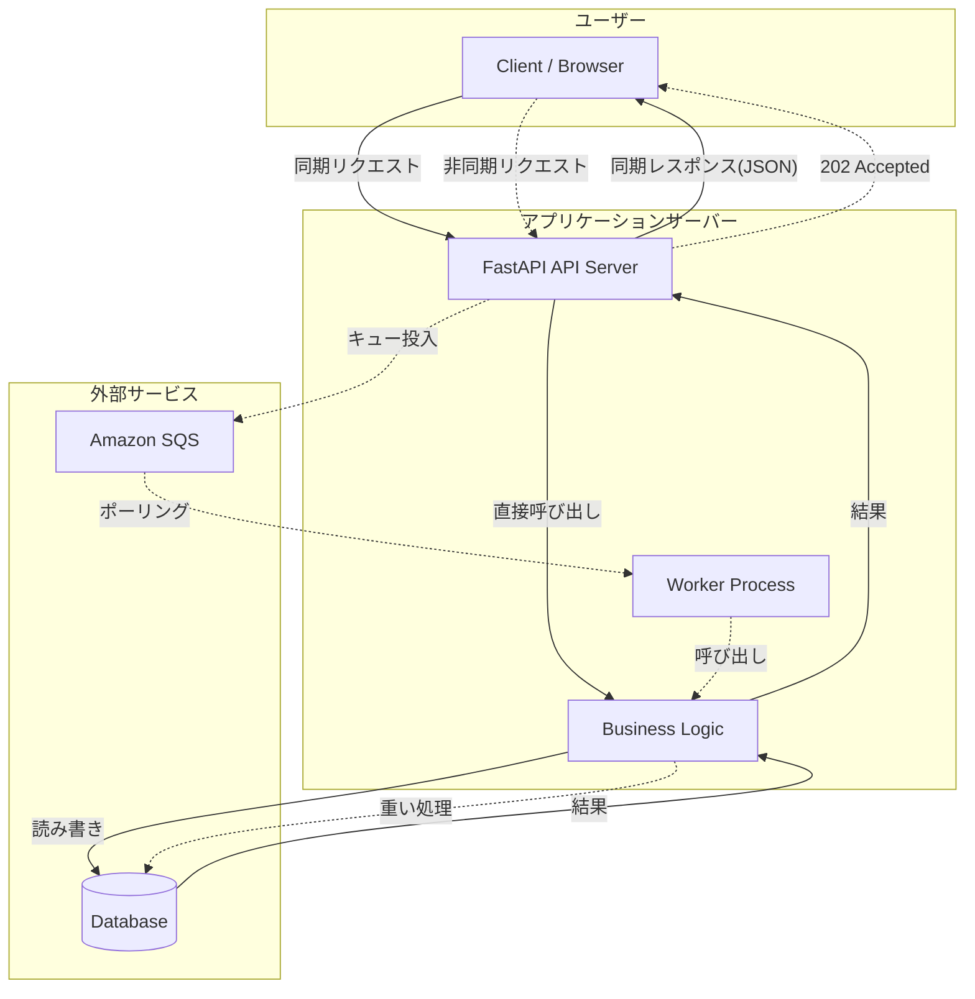

```mermaid
graph TD
  subgraph ユーザー
    Client[Client / Browser]
  end
  subgraph アプリケーションサーバー
    APIServer[FastAPI API Server]
    Worker[Worker Process]
    BL[Business Logic]
  end
  subgraph 外部サービス
    SQS[Amazon SQS]
    DB[(Database)]
  end

  %% 同期
  Client -->|"同期リクエスト"| APIServer
  APIServer -->|"直接呼び出し"| BL
  BL -->|"読み書き"| DB
  DB -->|"結果"| BL
  BL -->|"結果"| APIServer
  APIServer -->|"同期レスポンス(JSON)"| Client

  %% 非同期
  Client -.->|"非同期リクエスト"| APIServer
  APIServer -.->|"202 Accepted"| Client
  APIServer -.->|"キュー投入"| SQS
  SQS -.->|"ポーリング"| Worker
  Worker -.->|"呼び出し"| BL
  BL -.->|"重い処理"| DB
```
