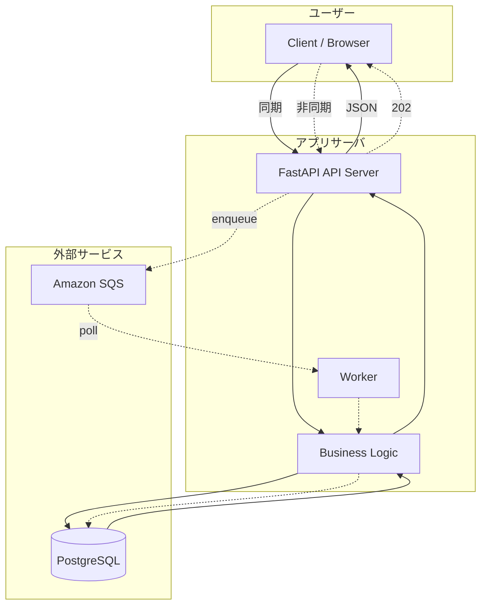

### 同期/非同期アーキテクチャ

```mermaid
graph TD
  subgraph ユーザー
    Client[Client / Browser]
  end
  subgraph アプリサーバ
    API[FastAPI API Server]
    Worker[Worker]
    BL[Business Logic]
  end
  subgraph 外部サービス
    SQS[Amazon SQS]
    DB[(PostgreSQL)]
  end
  Client -->|"同期"| API
  API --> BL --> DB --> BL --> API -->|"JSON"| Client
  Client -.->|"非同期"| API -.->|"202"| Client
  API -.->|"enqueue"| SQS -.->|"poll"| Worker -.-> BL -.-> DB
```

- **同期**: API → BL → DB を直列で処理し、そのままJSONを返す  
- **非同期**: リクエスト受領後すぐ **202**、キュー経由で Worker が後続処理
