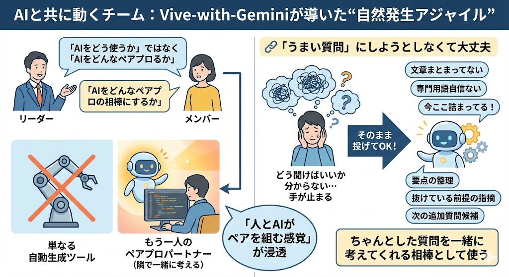
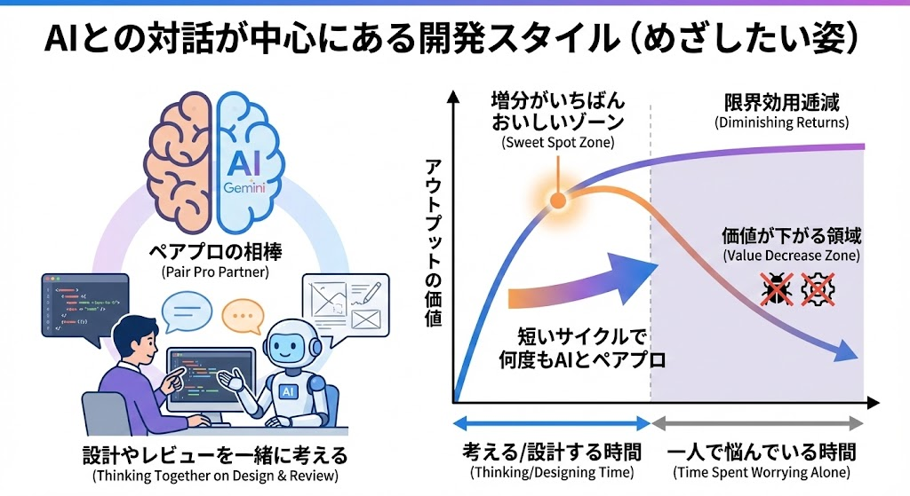
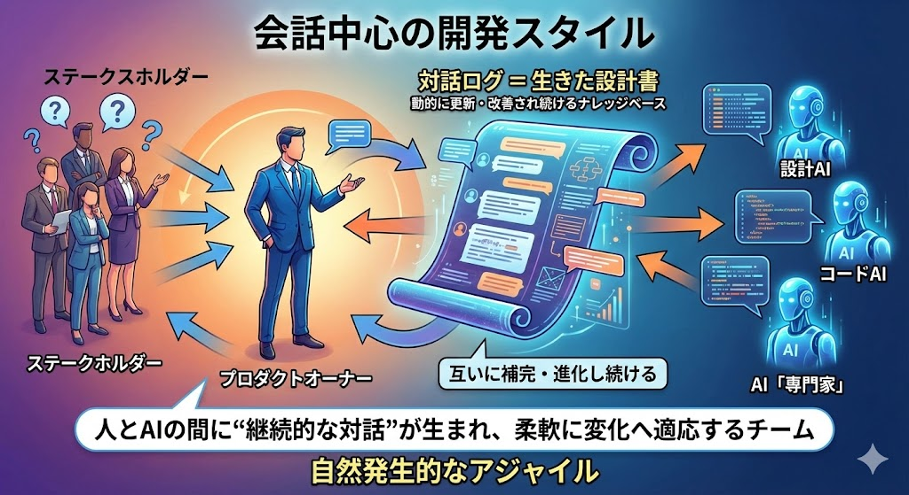
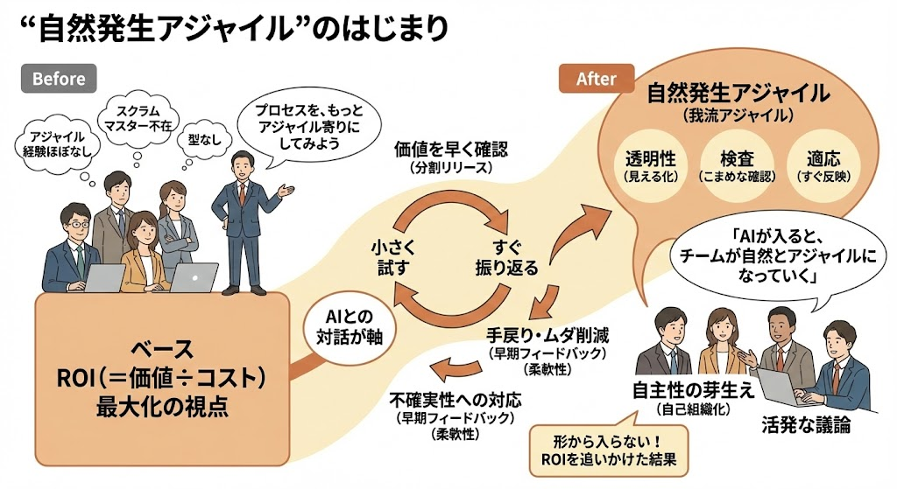
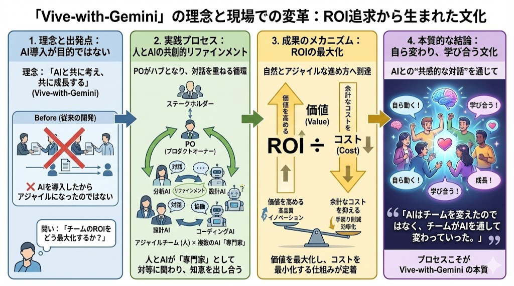

# AI開発事例発表会

## AI駆動開発事例発表会向け資料

### AIは「道具」でなく「相棒」
### 〜アジャイルなAI駆動開発の実践事例〜

## プロジェクト概要

- 題材：顧客管理システム刷新プロジェクトにおけるAI駆動開発
- 目的：クラウド化を含むシステム刷新を進めながら、ROIを最大化する
- アプローチ：AIを単なる自動化ツールではなく、設計・実装・テストの相棒として活用し、短いフィードバックループで改善を回す

## AIは「道具」ではなく「相棒」

開発現場では、AIを単にコード生成の道具として使うのではなく、
**設計・実装・テストを共に回す相棒**として位置づけました。これが、今回の発表で伝えたい核です。

---

## 1. 何が変わったのか

- **AIを「道具」から「対話する相棒」へ**
- **AIは単独ではなく、チームの一員として動く**
- **その結果、現場の開発サイクルが速く、柔軟になった**

### 1.1 目指したもの
- Value（価値提供）を上げる
- Cost（自動化・効率化）を下げる
- そのために、AIを「フィードバックループを早く回す相棒」として使う

---

## 2. どのように使ったか

### 2.1 マインドセット
- 完璧な質問は不要
- **まずは今の課題をそのままAIに相談する**
- AIは「新人だけど超優秀な後輩」

### 2.2 現場での使い方
- 設計：要件の曖昧さをAIとの会話で解消
- 実装：雛形やパターン生成をAIに任せ、人は業務ロジックに集中
- テスト：抜け漏れや追加ケースをAIに確認させ、短いサイクルで品質向上

### 2.3 実際の対応例
- **設計フェーズ**
  - API定義書（OpenAPI）やDB設計、社内規約をAIに読み込ませる
  - 設計レビュー案、ユースケース洗い出し、例外パターンのチェックを半自動化
  - 仕様変更時はAIに差分と影響箇所を洗い出させ、認識ズレを圧縮
- **実装フェーズ**
  - 良い実装パターンをプロンプトに埋め込み、Lambda／ストアドファンクション／DTOの雛形を生成
  - 人は意図や例外ケース、業務ロジックの詰めに集中
- **テストフェーズ**
  - pytest＋parametrize＋共通関数の標準を前提に、テスト雛形をAIに生成させる
  - 修正差分に対してAIに「ここにテストを足すべき」「このケースが抜けている」と指摘させる
- **CI/CD構想**
  - コードを書いたらすぐパイプラインが動き、結果が返ってくる状態を目指す

---

## 3. 何が起きたのか

### 3.1 現場の変化
- フィードバックのサイクルが速くなった
- 進捗と課題が見えるようになった
- 手戻りが減り、改善を小さく回せるようになった

### 3.2 自然発生アジャイル
- **スクラムを真似したのではなく、ROIを追いかけたらアジャイルになった**
- 透明性・検査・適応のサイクルが自然に近づいた

---

## 4. 発表で伝えたい3つのメッセージ

1. **AIは「道具」でなく「相棒」**
2. **対話の速度が価値提供を加速する**
3. **AIと人が協調すると、自然にアジャイルな振る舞いが育つ**

---

## 5. まとめ

- AIは単に作業を速める存在ではない
- AIと人が対話し続けることで、価値提供と学習の両方が高まる
- その結果、より価値を出せるチームと、より柔軟に変化へ対応できるアジャイルな開発文化が育ち始めた
