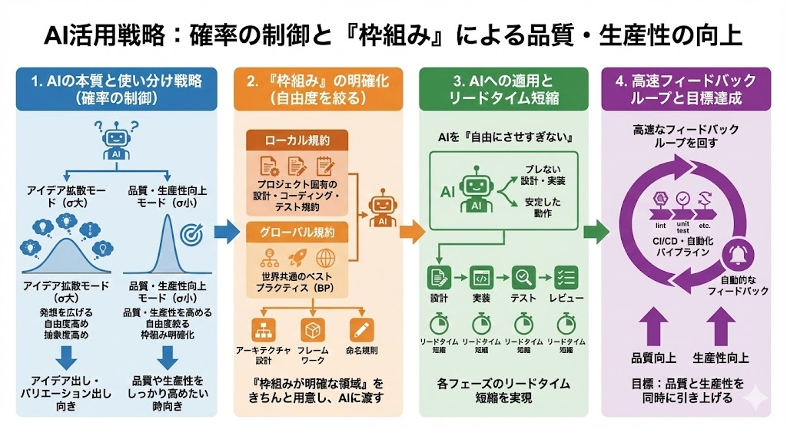
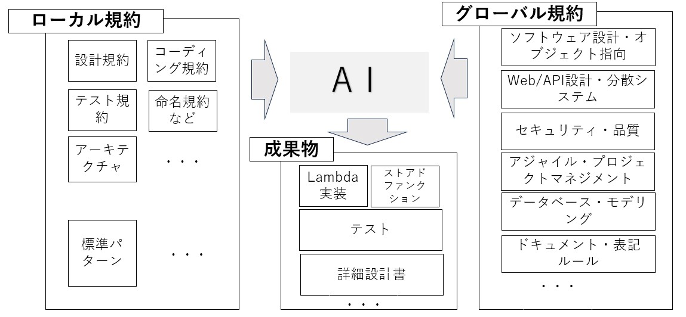
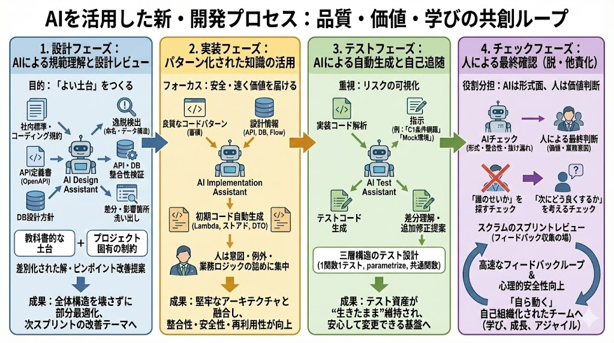
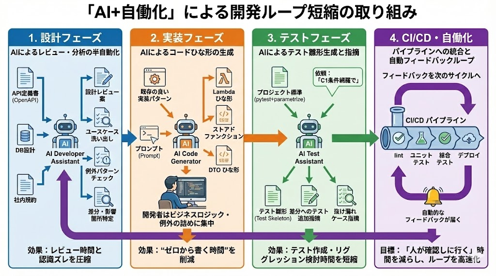
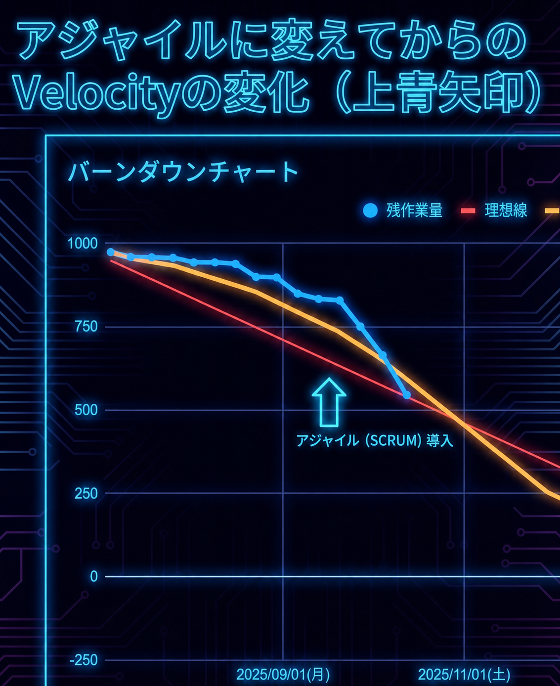

# 5.2 現場で磨かれるAI活用術

## Vive with Gemini実践編（発表用簡略版）

5.1では、なぜAIを「道具」ではなく「相棒」として扱うのかを紹介しました。
5.2では「どのように」実践するのかを、**設計・実装・テスト・確認**の流れに沿って紹介します。

> **目的はAIにコードを書かせることではありません。 
> AIとの対話と自動化によってフィードバックループを短くし、ROI（投資対効果）を最大化することです。**

---

## 1. 実践の前提

AIは確率的に応答し、もっともらしい誤りを返す可能性があります。
そのため、AIに任せきりにせず、次の3つを組み合わせます。

- 規約や条件をコンテキストとして与える
- 自動テストで機械的に検証する
- 人が意図・価値・安全性を確認し、最終判断と責任を持つ

---

## 2. AI活用を支える「枠組み」

成果物の品質を揃えるため、次の2種類の情報を判断の枠組みとして与えます。

- **プロジェクト固有ルール**：対象プロジェクトの設計、命名、実装、テスト規約
- **共通技術ガイドライン**：共通のアーキテクチャ方針やベストプラクティス

これらに加え、AIへの入力が許可された情報をコンテキストとして与えます。
API定義書やDB設計などを組み合わせ、プロジェクトに合う案を得やすくします。

---

## 3. 開発工程での実践

### 設計

- 入力が許可されたAPI定義書、DB設計、社内規約をコンテキストとして与える
- 仕様の曖昧さ、矛盾、例外パターンの洗い出しを支援させる
- 仕様変更による差分と影響範囲の候補を整理する

### 実装

- 良い実装パターンからコードの雛形を生成する
- 人は業務ロジック、設計意図、例外ケースに集中する
- 小さく実装し、AIによるレビュー支援を繰り返す

### テスト

- プロジェクト標準に沿ったテストの雛形を生成する
- 修正差分から、不足しているテストケースを提案させる
- 自動テストの結果を次の修正へすぐ反映する

### 確認

- AIが形式面、整合性、抜け漏れの確認を支援する
- 人が業務価値、意図、安全性を確認し、最終判断と責任を持つ
- 問題を個人の責任ではなく、次の改善材料として扱う

---

## 4. AIと自動化でフィードバックを速くする

設計、実装、テスト、確認を別々の工程として切り離さず、
得られた結果をすぐ次の判断へ返すループとして扱います。

1. AIと設計案を作る
2. 小さく実装する
3. AIによる確認支援と自動テストを使う
4. 人が価値と品質を最終判断する
5. 学びを次の改善へ反映する

> **チームの価値は、単位時間あたりに得られるフィードバックの量と質に大きく左右される**

---

## 5. 変化を捉える

- Velocity（スプリントごとの完了量）を可視化したことで、ばらつきや停滞を早めに把握しやすくなった
- AIの誤りも、規約やテストを改善するための学習材料として扱う

> ※ この図はAIだけの効果を示すものではなく、スクラム運営や作業分割などを含むチーム改善全体の結果です。

---

## 6. まとめ

- AIへの入力が許可された情報と、2種類のルールをコンテキストとして与える
- 規約、自動テスト、人の確認を組み合わせ、最終判断と責任は人が持つ
- 短いフィードバックループを回し、AIを相棒としてROI最大化を目指す

> **チームがAIを通してアジャイルに成長していく。 
> それがVive with Geminiの実践です。**

時間に余裕がある場合は、次の「5.3 現在のAI活動」で、
閉域環境へ配置する社内向けMaaS（Model as a Service：モデル提供サービス）基盤の取り組みを紹介します。

👉 [5.3 現在のAI活動（時間があれば）](./ai-agile-vive-with-gemini-5-3)
