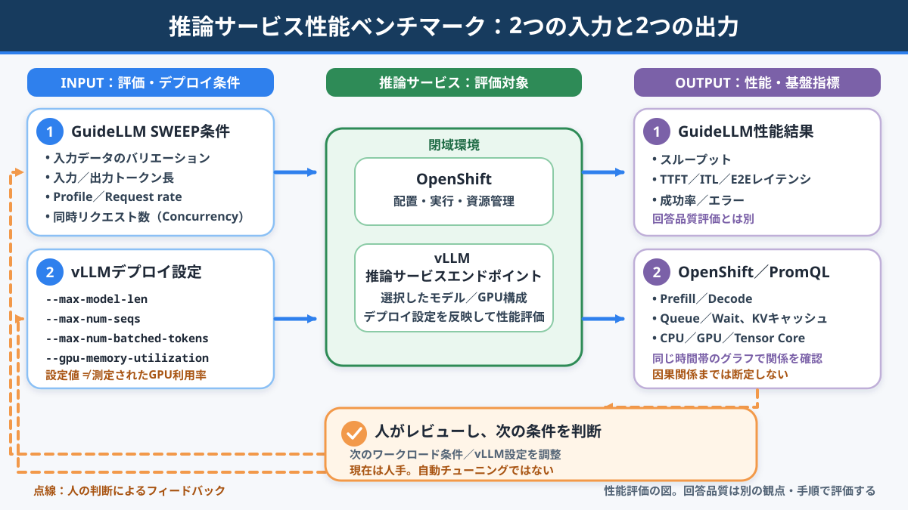
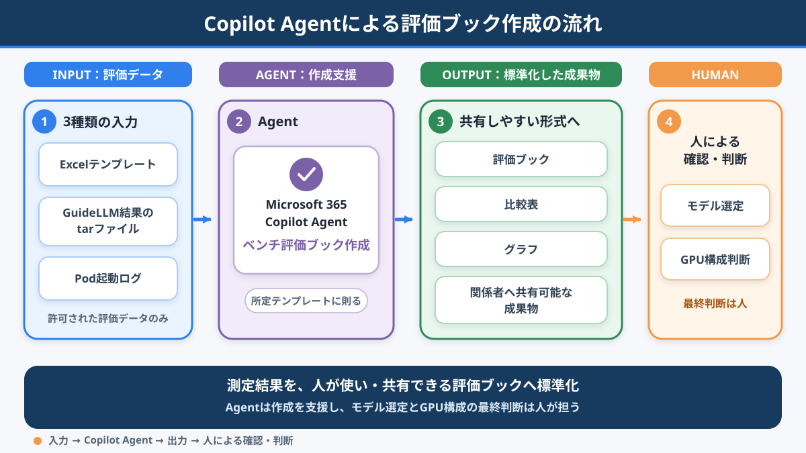
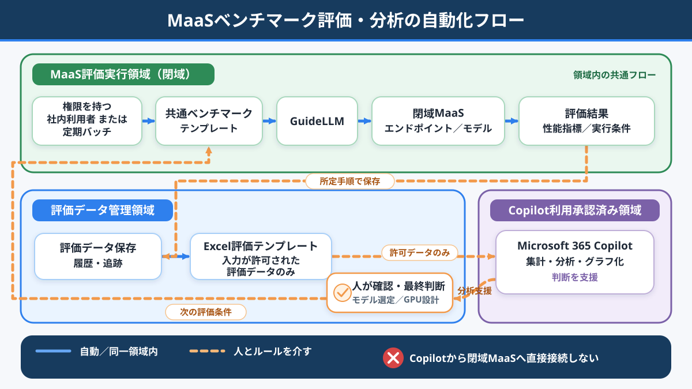
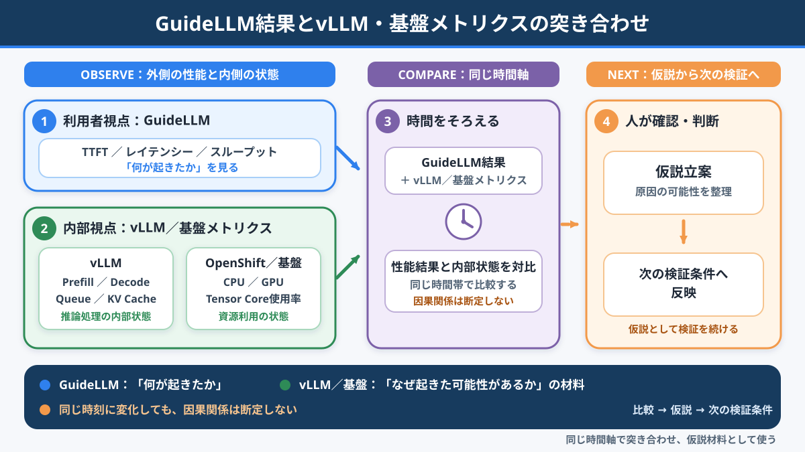

# 5.3 現在のAI活動

## NOW：閉域環境向けお客様社内MaaS（モデル提供サービス）基盤

ここまで紹介した顧客管理システム刷新とは別に、
現在はお客様社内向けMaaS（Model as a Service：モデル提供サービス）基盤の構築に取り組んでいます。

MaaSの配置先は、エアギャップ／閉域環境です。
外部接続が許可された承認済み領域でMicrosoft 365 CopilotとVS Code上のCodexを利用し、
レビュー・承認済みの成果物だけを所定の手順で閉域環境へ反映します。
**閉域環境からクラウドAIへ直接接続する構成ではありません。**

現在の取り組みは、次の4本柱です。

1. セキュリティ境界を守ったAI協働開発
2. OpenShift／KubernetesによるMaaS実行基盤
3. GuideLLMとExcelによるモデル性能評価自動化
4. GitLab Issueと1週間スプリントによる適応型開発

第1柱は「AI利用領域と閉域領域の分離」と
「Microsoft 365 CopilotとCodexの役割」の2節で説明します。

> **チームの価値は、単位時間あたりに得られるフィードバックの量と質に大きく左右される**

ここでいう「ROI最大化」は、厳密な財務指標ではありません。
提供価値を高めながら総コストを下げるという、
Vive with Gemini固有の“方言”です。
この4本柱を短いフィードバックループでつなぎ、その実現を目指します。

### 現在地

**構築済み（現在も改善中）**

- GuideLLMを共通手順で実行する性能ベンチマークテンプレート
- 権限を持つ社内利用者による任意実行と、プロジェクト側の定期バッチによる実行方法
- 評価条件と結果を保存し、Excelテンプレートへ取り込む流れ
- Microsoft 365 Copilotの独自Agent「ベンチ評価ブック作成」と、プロジェクト関係者への公開
- Excelテンプレート、GuideLLMの評価結果、Pod起動ログから評価ブックを作成する流れ

**実施中**

- 社内向けMaaS基盤の構築
- AI利用領域と閉域領域を分けた開発方法の検証
- GPUスケジューリング方針の設計・検証
- GuideLLMの負荷条件とvLLMのデプロイ設定を組み合わせた性能比較
- 対象モデル、評価条件、保存項目を広げるベンチマーク運用
- OpenShift Webコンソールで、vLLMと実行基盤のメトリクスを同一時間帯にそろえて確認
- 評価作業の自動化による効果の計測
- GitLab Issueを利用した1週間スプリント

**今後実施**

- 情報管理ルールと閉域環境への反映手順の標準化
- 評価データの履歴管理、追跡、バックアップの強化
- vLLMメトリクスの取得・時間同期からAgentへの依頼までを一気通貫で自動化
- CI/CD（継続的インテグレーション／継続的デリバリー）、自動テスト、監視の整備
- 運用データに基づく継続的な改善

この章では、構築済みの仕組み、実施中の検証、今後の構想を区別します。
数値による効果は、まだ評価中です。

---

## 1️⃣ AI利用領域と閉域領域を分離する

今回の構成では、AI利用の境界を次のように分けています。

- **承認済み領域**
  - 外部接続が許可された環境でMicrosoft 365 CopilotとCodexを利用する
  - AIへの入力が許可された情報をコンテキストとして与える
- **受け渡し**
  - 人が成果物をレビューし、内容と安全性を承認する
  - 承認済み成果物だけを所定の手順で閉域環境へ反映する
- **エアギャップ／閉域環境**
  - MaaSを配置・実行する
  - クラウドAIへ直接接続しない

AIは確認を支援しますが、**最終判断と責任は人が持ちます。**

---

## 2️⃣ Microsoft 365 CopilotとCodexの役割

承認済み領域で、役割を分けて利用しています。

### Microsoft 365 Copilot

- 会議内容やユーザー要望の整理
- 論点、決定事項、未決事項の可視化
- 説明資料や振り返り内容のたたき台作成
- Excelに取り込んだベンチマーク結果の集計・分析・可視化支援
- 独自Agent「ベンチ評価ブック作成」による、所定のExcel評価ブックの作成支援

### VS Code上のCodex

- OpenShift／Kubernetesマニフェストや設定ファイルの作成支援
- APIや管理機能の設計・実装支援
- テスト観点、ログ、エラー、影響範囲の確認支援
- GitLab IssueやMerge Requestに対応した変更内容の整理
- READMEや運用手順書の更新支援

> **AIは道具でなく相棒。**
> ただし、AIの提案を採用するかどうかは人が判断し、結果に責任を持ちます。

---

## 3️⃣ Kong、OpenShift／Kubernetes、GPUの責任を分ける

MaaSの入口と実行基盤は、次のように責任を分けます。

- **Kong Gateway**
  - 認証、入口制御、API／モデルへのルーティング
  - 必要に応じた流量制御
- **OpenShift／Kubernetes**
  - Podの配置、実行、スケーリング、資源管理
- **GPU**
  - OpenShift／KubernetesがPodを適切なGPU搭載ノードへ配置する
  - NVIDIA H100 80GB HBM3など、必要なGPUをPodへ割り当てる

CPU／メモリにはRequests（要求量）とLimits（上限）を設定します。
GPUはNVIDIA H100 80GB HBM3など、必要なGPUを指定し、
GPUのRequestsとLimitsを別々の値には調整しません。

目指すのは、利用者にはKong Gatewayを通じた共通の入口を提供し、
裏側ではOpenShift／KubernetesがPodとGPUを管理する状態です。

---

## 4️⃣ 多様なモデルを短時間で比較する性能ベンチマーク自動化

MaaSでは提供候補となるモデルが複数あり、
モデルごとに応答性能や資源効率が異なります。

モデルの追加や更新のたびに、条件設定、試験実行、結果収集、
Excelへの転記やグラフ作成を個別に行うと、評価作業そのものに時間がかかります。

そこで、さまざまなモデルを同じ手順と形式で比較するため、
オープンソースソフトウェア（OSS）の
[GuideLLM](https://github.com/vllm-project/guidellm)を使った評価自動化を進めています。

**GuideLLMで行うのは、スループットやレイテンシーなどの性能評価です。**
回答の正確性、妥当性、安全性、業務適合性などを確認する
**回答品質評価とは分けて扱います。**
性能が高いことは、回答品質が高いことを意味しません。

### 入力1：GuideLLM側の負荷条件を変える

GuideLLMのSweep（条件を段階的に変える試行）は、
フロント側から与える負荷を変える比較です。
固定する条件と変える条件を、分けて記録します。

- 対象モデルと対象エンドポイント
- 入力データの種類／分布
- 負荷プロファイル
- 入力トークン数と要求する出力トークン数
- リクエストレート
- 同時実行数（Concurrency）
- 最大リクエスト数または試験時間
- 実行日時

**リクエストレートと同時実行数は、別の条件として記録します。**

### 入力2：vLLM側のデプロイ設定を変える

性能を左右する入力は、GuideLLM側の負荷条件だけではありません。
vLLMのデプロイ設定も、もう一つの入力軸として扱います。

- `--max-model-len`：入力と出力を合わせた最大コンテキスト長
- `--max-num-seqs`：1回の反復で処理する最大シーケンス数
- `--max-num-batched-tokens`：1回の反復で処理する最大トークン数
- `--gpu-memory-utilization`：vLLMインスタンスがモデル実行に使用するGPUメモリ割合

1つのvLLM設定を反映してGuideLLMの負荷条件をSweepし、
設定を変えた場合は同じ負荷条件で再評価します。
比較時は、モデル、vLLMのバージョン、GPU構成、レプリカ数などの
前提条件もそろえます。

各設定は相互に影響するため、値を大きくすれば常に性能が上がるとは限りません。
また、`--gpu-memory-utilization`は設定値であり、
PromQLで確認する実測のGPU利用率とは別です。
利用できる引数と既定値はvLLMのバージョンで異なるため、
実環境の`vllm serve --help`で確認します。

### ベンチマークの入力と出力

2つの入力をOpenShift上のvLLM／MaaSエンドポイントへ与え、
GuideLLMの性能結果とPromQLの基盤メトリクスを同じ時間帯で比較します。
図は自動チューニングを示すものではありません。
人が結果を確認し、次の負荷条件とvLLM設定を判断します。

### 出力1：GuideLLMの性能結果を見る

評価結果では、リクエストスループット、出力トークンスループット、
応答時間／レイテンシー、
Time to First Token（TTFT：最初のトークンが返るまでの時間）、
入出力トークン数、成功・未完了・エラー件数などを比較対象とします。
成功率が必要な場合は、取得した件数から算出します。

実際に取得・保存できている指標だけを判断に使い、
未確認の指標を実装済みとは扱いません。

### 権限を持つ社内利用者が同じ手順で実行する

利用者がGuideLLMのコマンドを毎回組み立てるのではなく、
対象モデルと評価条件を指定する共通テンプレートを使います。

実行方法は、次の2つです。

1. 権限を持つ社内利用者が任意のタイミングで実行する
2. プロジェクト側の定期バッチとして自動実行する

これにより、担当者が変わっても同じ手順・同じ形式で評価し、
モデル間比較と時系列比較へつなげます。

### 評価データを保存し、Copilot Agentで評価ブックを作成する

評価条件と結果はセットで保存し、次の目的に利用します。

- 評価結果の消失防止
- 同じ条件を再現するための記録
- モデル更新前後と時系列での比較
- 評価結果の監査・追跡

GuideLLMを使ったベンチマーク業務を効率化するため、
Microsoft 365 CopilotのAgent機能を使った独自Agent
「ベンチ評価ブック作成」を作成し、プロジェクト関係者へ公開しました。

このAgentへの入力は、次の3点です。

- 評価内容を定義したExcelブックのテンプレート
- GuideLLMによる評価結果を格納したtarファイル
- Pod起動時のログ

### Copilot Agentによる評価ブック作成の流れ

Agentは3種類の入力から測定結果を読み取り、
所定のテンプレートに則った、人が確認できる評価ブックへ変換します。
個人作業の効率化に加え、関係者へ共有しやすい形式へ標準化します。
モデル選定とGPU構成の最終判断は人が行います。

一連の流れは、次のとおりです。

1. GuideLLMでベンチマークを実行する
2. GuideLLMの評価結果のtarファイルと、Pod起動時のログを保存する
3. Excelテンプレート、tarファイル、Pod起動ログを「ベンチ評価ブック作成」Agentへ入力する
4. Agentがテンプレートに則った評価ブックを作成する
5. vLLM側のメトリクスをGuideLLMの実行時間帯と同期させる
6. 同じAgentへvLLMメトリクスを渡し、初回とは異なる依頼内容で追加評価を行う
7. 人が元データ、集計結果、表、グラフを確認し、回答品質などの別評価も踏まえて、モデル採用とGPU資源設計を最終判断する

この一連の流れをAIエージェント化したことは、
評価業務の大幅な効率化につながりました。
削減時間や削減率による定量評価は、引き続き実施します。

Microsoft 365 Copilotへ渡すのは、
**社内ルール上、入力が許可された評価データだけ**です。
GuideLLMの出力にプロンプトや応答の内容が含まれる場合は、
許可された集計データだけに絞ります。
Microsoft 365 Copilotが評価の正しさを保証するものではありません。

### MaaS性能ベンチマーク・分析の自動化フロー

これは業務フローであり、物理的なネットワーク構成を示す図ではありません。
点線は、人とルールを介した所定の受け渡しを表します。

> **この図は性能評価の流れです。回答品質評価は含みません。**

このループは、
**実行 → 保存 → 分析支援 → 人による判断 → 次の評価条件**をつなぎます。
Microsoft 365 Copilotから閉域MaaSへ直接接続する構成ではありません。

### 出力2：OpenShift上のメトリクスと時間をそろえて見る

GuideLLMの結果に加え、OpenShift Webコンソールで
Prometheus Query Language（PromQL：Prometheusクエリ言語）を使い、
vLLMと実行基盤のメトリクスを同じ時間帯にそろえてグラフで確認しています。

- **vLLM**
  - Prefill（入力処理）／Decode（出力生成）の処理時間
  - Queue／Wait（キュー待ち時間・待機リクエスト数）
  - KV（Key-Value）キャッシュ関連指標（キャッシュヒット率など）
- **OpenShift／コンテナ基盤**：CPU利用率
- **NVIDIA GPU監視**：GPU利用率、Tensor Core使用率

### GuideLLM結果とvLLM・基盤メトリクスの突き合わせ

GuideLLMは利用者視点で「何が起きたか」を見ます。
vLLMと基盤メトリクスは「なぜ起きた可能性があるか」を考える材料です。
両者を同じ時間軸で比較しますが、時間が一致しただけで因果関係は断定しません。

取得できる指標名と範囲は、vLLMのバージョンや監視構成によって異なります。
KVキャッシュ使用率とキャッシュヒット率は、別の指標として扱います。

現時点では、PromQLの選択、メトリクスの取得、表示期間の同期を人が行い、
その結果を確認しています。
時間をそろえたvLLMメトリクスは、同じ「ベンチ評価ブック作成」Agentへ
初回とは別の依頼として渡し、GuideLLMの結果と合わせて追加評価します。
データの準備からAgentへの依頼までを一気通貫にすることは、今後の自動化・改善候補です。

### 評価コストの低減を計測する

自動化では、次の手作業の削減を進めています。

- 評価条件の設定と、複数モデルの個別実行
- 結果ファイルの収集、Excelへの転記、集計式とグラフの作成
- PromQLグラフの表示期間をそろえ、GuideLLMの結果と突き合わせる作業
- 担当者ごとの手順差による再作業
- 定期評価を忘れずに実行するための管理

同じ条件で多様なモデルを比較しやすくし、
モデル追加・更新時の評価サイクル、GPU構成の検討、
ユーザー要望に合うモデルの提案を早めることを目指します。

削減時間や削減率はまだ確定していません。
評価作業の自動化による効果を計測中です。

---

## 5️⃣ GitLab Issueを利用した1週間スプリント

要望、課題、調査、実装、改善はGitLab Issueを正として管理します。
背景、受け入れ条件、完了条件、Merge Request、検証結果をつなぎ、
**なぜ対応するのか、何をもって完了とするのか**を見える化します。

スクラムをベースに1週間スプリントで開発を進め、
毎週、検証結果または動く成果物を示してフィードバックを得ます。

> **要望をGitLab Issueへ整理する
> → 設計・実装・テストする
> → 人が確認する
> → レビューで学ぶ
> → 次のGitLab Issueへ反映する**

AIはGitLab Issueの分割、受け入れ条件、影響範囲、テスト観点の整理を支援します。
GitLab IssueやMerge Requestの内容、成果物の最終判断は人が担います。

---

## 6️⃣ 4本柱を1つのフィードバックループへ

> **ユーザーと対話する
> → GitLab Issueへ整理する
> → AIの支援を受けて設計・実装する
> → 人がレビュー・承認する
> → 閉域MaaSで実行・計測する
> → GuideLLMでモデル性能を比較する
> → 人が次の改善を判断する**

AI協働、MaaS実行基盤、モデル性能評価自動化、適応型開発を分断せず、
一つのループとして回します。

---

## 7️⃣ Vive with Geminiの“方言”「ROI最大化」

> **本資料で使う「ROI最大化」は、厳密な財務指標としてのROIを意味しません。**
> Vive with Geminiで以前から使っている、
> **提供価値を高めながら、開発・運用・評価に必要な総コストを下げる**
> という考え方を表す、プロジェクト内の“方言”です。

提供価値には、開発速度だけでなく、品質、再現性、
利用者への提供速度、GPU利用効率、意思決定の速さを含めます。

総コストには、利用料金だけでなく、手作業、待ち時間、
確認作業、再作業、運用負荷を含めます。

財務上のROI算定式は使わず、各指標の変化を継続的に確認します。
ベンチマーク自動化は、その具体例の一つです。

---

## 8️⃣ 代表KPI

本編では、現在値や改善効果ではなく、
今後継続して確認する代表的なKPI（重要業績評価指標）を示します。

- 評価開始からレポート完成までの所要時間
- 比較可能な評価済みモデル数
- GPU利用率
- GPU割り当て待ち時間
- 推論応答時間
- ユーザー要望の反映期間

測定条件をそろえ、AIだけの効果とは断定せず、
スクラム運営、作業分割、基盤改善を含むチーム全体の変化として評価します。

---

::: details 補足：設計・運営・評価の詳細

**GPUスケジューリングの検討項目**

- **Node Label／Node Selector**
  - GPU種別、性能、用途に応じて配置先を制御する
- **Affinity／Anti-Affinity**
  - 関連するPodの配置や、競合するPodの分散を制御する
- **Taint／Toleration**
  - GPU搭載ノードへ不要なワークロードが配置されないようにする
- **CPU／メモリのRequests／Limits**
  - スケジューリングに使う要求量と、コンテナが利用できる上限を指定する
- **GPU拡張リソース**
  - NVIDIA Device Pluginを利用する場合は、NVIDIA H100 80GB HBM3など、必要なGPUを指定する
  - GPUのRequestsとLimitsは別々の値に調整しない
- **PriorityClass**
  - 緊急性や業務上の重要度に応じて、ワークロードの優先順位を設定する
- **ResourceQuota／LimitRange**
  - Namespace単位の資源利用範囲や、既定値・上限・下限を管理する
- **監視データを使った改善**
  - GPU利用率、割り当て待ち時間、Pod起動時間、推論応答時間を計測し、配置ルールを見直す

**GuideLLMの詳細な評価条件**

- 対象モデル
- 対象エンドポイント
- 入力データの種類／分布
- 負荷プロファイル（同期、同時実行、一定レートなど）
- 入力トークン数
- 要求する出力トークン数
- リクエストレート
- 同時実行数（Concurrency）
- 最大リクエスト数または試験時間
- 実行日時

リクエストレートは一定時間あたりの要求数、
同時実行数は並行して処理する要求数として区別します。

**GuideLLMによる性能評価結果の候補**

- リクエストスループット
- 出力トークンスループット
- 応答時間／レイテンシー
- Time to First Token（TTFT）
- 入力および出力トークン数
- 成功・未完了・エラー件数
- 件数から算出する成功率
- リクエストレート
- 同時実行数

取得できる項目はGuideLLMのバージョン、実行条件、出力形式で変わるため、
実際に取得・保存できている項目だけを実績として扱います。
これらは回答品質を示す指標ではありません。

**保存する評価データ項目**

以下は、保存項目の標準化対象です。
現在保存していない項目は、今後追加する項目として扱います。

- 実行日時
- 対象モデル
- モデルまたはエンドポイントのバージョン
- 入力データの種類／分布
- 負荷プロファイル
- 入力トークン数
- 出力トークン数
- リクエストレート
- 同時実行数
- 実行環境
- GPU構成とレプリカ数
- GPUまたはノードに関する識別情報
- GuideLLMのバージョン
- vLLMのバージョン
- `--max-model-len`
- `--max-num-seqs`
- `--max-num-batched-tokens`
- `--gpu-memory-utilization`
- 性能評価結果
- エラー情報

GPUやノードの識別情報など、GuideLLMが自動収集しない情報は、
プロジェクト側で付与できる場合に保存します。

**Excel評価ブック作成Agentの詳細**

- Microsoft 365 Copilotの独自Agent「ベンチ評価ブック作成」をプロジェクト関係者へ公開している
- 評価内容を定義したExcelテンプレート、GuideLLMの評価結果を格納したtarファイル、Pod起動ログをAgentへ入力する
- Agentが所定の列と形式に則った評価ブックを作成する
- モデル別・条件別の比較表を作る
- スループットやレイテンシーなどをグラフ化する
- 時間をそろえたvLLMメトリクスは、同じAgentへ別の依頼として渡して追加評価する
- 元データ、集計式、生成された表とグラフを人が確認する
- モデル採用とGPU構成は人が最終判断する

テンプレートと依頼文を共通化し、
担当者による分析手順のばらつきを抑えます。

**1週間スプリントの進め方**

1. **バックログリファインメント**
   - ユーザー要望を整理し、GitLab Issueを実装可能な大きさへ分割する
2. **スプリントプランニング**
   - 価値、緊急度、依存関係、実現可能性から対象のGitLab Issueを選ぶ
3. **実装・検証**
   - AIの支援を受けながら、小さな単位で設計、実装、テストを進める
4. **Merge Requestレビュー**
   - 人が設計意図、テスト結果、運用影響を確認する
5. **スプリントレビュー**
   - 動くものをユーザーや関係者へ示し、フィードバックを得る
6. **レトロスペクティブ**
   - プロセス上の課題を振り返り、次週に試す改善を決める

**評価指標の候補**

開発プロセス：

- GitLab Issueの作成から完了までのリードタイム
- 1スプリントあたりの完了したGitLab Issue数
- スプリント内完了率
- Merge Requestのレビュー時間
- 仕様変更による手戻り件数
- AI支援を利用した作業の所要時間
- 自動テストの実行数と検出不具合数

ベンチマーク自動化：

- 1モデルあたりの評価準備時間
- ベンチマーク実行からレポート作成までの所要時間
- 定期評価の実行成功率
- 手作業での転記・集計回数
- 比較可能な評価済みモデル数
- モデル更新から再評価完了までの時間

MaaS基盤：

- GPU利用率
- GPU割り当て待ち時間
- Pod起動時間
- 推論応答時間
- 同時実行数
- モデルごとの資源使用量
- Namespace／チームごとの利用量
- 障害件数と復旧時間

ユーザー価値：

- 利用ユーザー数
- 利用モデル数
- ユーザーからの改善要望数
- ユーザー要望の反映期間
- 継続利用率
- 手作業や既存業務に要した時間の変化

一部は現在確認中ですが、この一覧は改善効果を示す実績値ではありません。
未着手の指標は、定義と測定条件を整える候補です。

**今後実施すること**

- AI利用時の情報管理ルールを明文化する
- 閉域環境への反映手順を標準化する
- GPUスケジューリング方針を実測データに基づいて改善する
- モデルの追加・更新手順を整備する
- GuideLLMの負荷条件、vLLMのデプロイ設定、保存項目、実行履歴を標準化する
- PromQLの選択、時間同期、GuideLLMの結果との突き合わせ、レポート作成を自動化する
- 評価結果のバックアップと監査・追跡方法を強化する
- CI/CD、自動テスト、監視を整備する
- GitLab Issueと運用・評価メトリクスを結び付ける
- 他プロジェクトでも再利用できる社内標準MaaS基盤へ育てる

完成形や効果を先に決めず、
ユーザーフィードバックと運用・評価データに基づいて改善します。

:::

---

## 💬 結び

AI利用領域と閉域領域を分け、人が最終判断と責任を担う。
Kong GatewayとOpenShift／Kubernetesの責任を分け、
GuideLLMとExcelでモデル性能評価を同じ手順へそろえる。
1週間スプリントで、結果を次の改善へつなぎます。

> **AI、人、プラットフォーム、評価データが短い周期で学び続けられる仕組みをつくる。**
> そのフィードバックループで、Vive with Geminiでいう「ROI最大化」を目指します。
