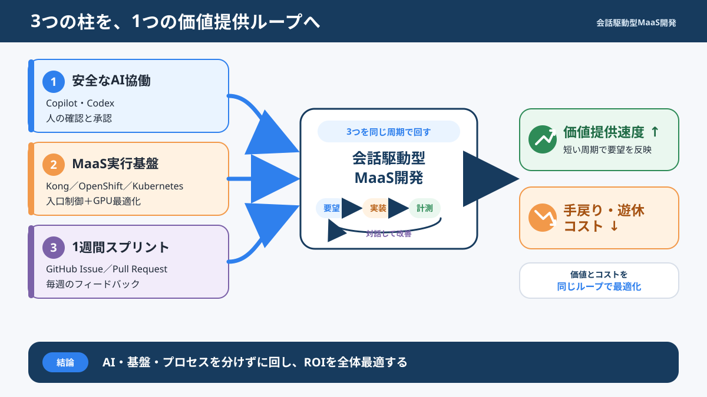
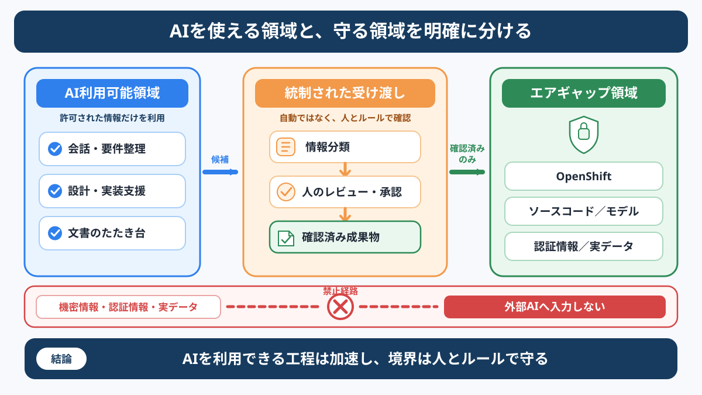
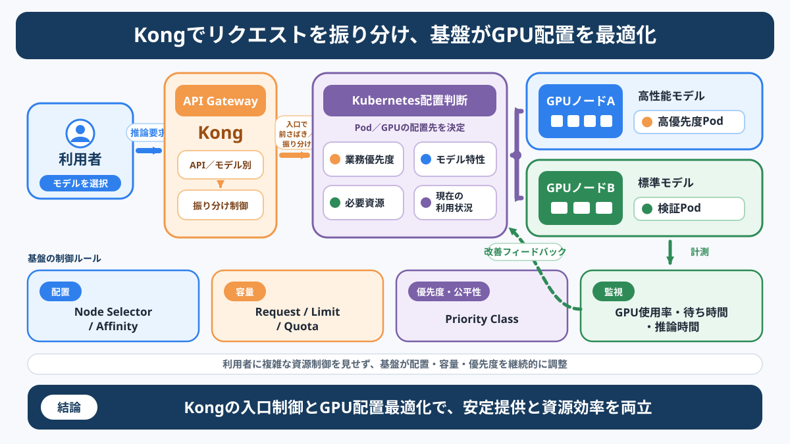
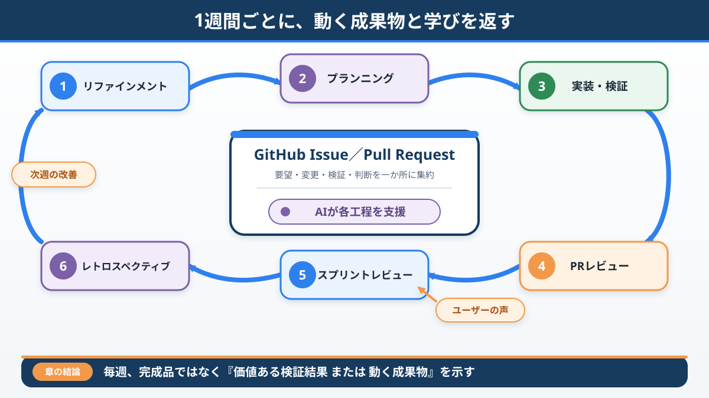
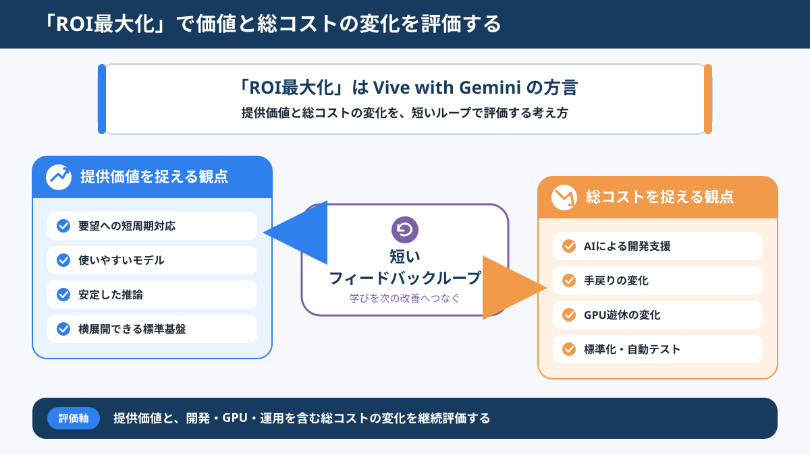
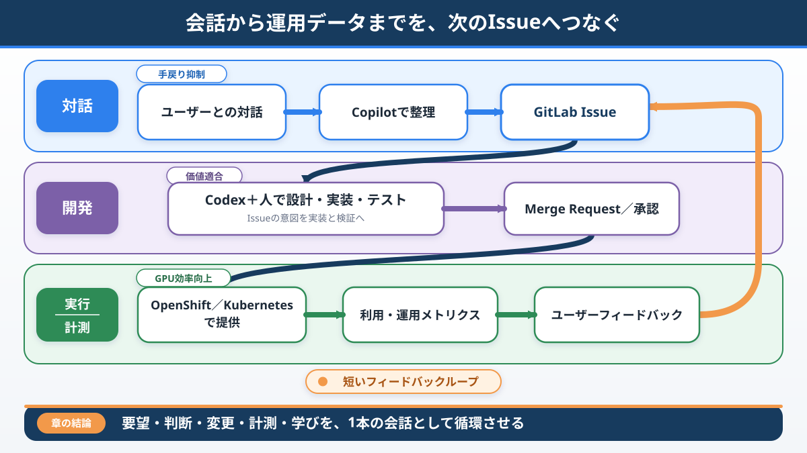

# 5.3 現在のAI活動（時間があれば）

## NOW：閉域環境向け社内MaaS（モデル提供サービス）基盤

ここまで紹介した顧客管理システム刷新とは別に、
現在は社内向けMaaS（Model as a Service：モデル提供サービス）基盤の構築に取り組んでいます。

MaaSの配置先は、エアギャップ／閉域環境です。
外部接続が許可された承認済み領域でMicrosoft 365 CopilotとVS Code上のCodexを利用し、
レビュー・承認済みの成果物だけを所定の手順で閉域環境へ反映します。
**閉域環境からクラウドAIへ直接接続する構成ではありません。**

本編では、次の5テーマに絞って紹介します。

1. AI利用領域と閉域領域の分離
2. CopilotとCodexの役割
3. Kong Gateway、OpenShift／Kubernetes、GPUの責任分離
4. GitHub Issueを利用した1週間スプリント
5. ROIを確認する代表的な指標

> **チームの価値は、単位時間あたりに得られるフィードバックの量と質に大きく左右される**

単にAIツールやGPU基盤を導入するのではなく、
短いフィードバックループでROI（投資対効果）を高められるかを検証する取り組みです。

### 現在地

**実施中**

- 社内向けMaaS基盤の構築
- AI利用領域と閉域領域を分けた開発方法の検証
- GPUスケジューリング方針の設計・検証
- GitHub Issueを利用した1週間スプリント

**今後実施**

- 情報管理ルールと閉域環境への反映手順の標準化
- CI/CD（継続的インテグレーション／継続的デリバリー）、自動テスト、監視の整備
- 運用データに基づくROI評価と継続的な改善

この章の内容は、完成済みの基盤や確定した効果を示すものではありません。

---

## 1️⃣ AI利用領域と閉域領域を分離する

AI利用の境界は、次のように定めます。

- **承認済み領域**
  - 外部接続が許可された環境でCopilotとCodexを利用する
  - AIへの入力が許可された情報をコンテキストとして与える
- **受け渡し**
  - 人が成果物をレビューし、内容と安全性を承認する
  - 承認済み成果物だけを所定の手順で閉域環境へ反映する
- **エアギャップ／閉域環境**
  - MaaSを配置・実行する
  - クラウドAIへ直接接続しない

AIは確認を支援しますが、**最終判断と責任は人が持ちます。**

---

## 2️⃣ CopilotとCodexの役割

承認済み領域で、役割を分けて利用しています。

### Microsoft 365 Copilot

- 会議内容やユーザー要望の整理
- 論点、決定事項、未決事項の可視化
- 説明資料や振り返り内容のたたき台作成

### VS Code上のCodex

- OpenShift／Kubernetesマニフェストや設定ファイルの作成支援
- APIや管理機能の設計・実装支援
- テスト観点、ログ、エラー、影響範囲の確認支援
- GitHub IssueやPull Requestに対応した変更内容の整理
- READMEや運用手順書の更新支援

> **AIは道具でなく相棒。**
> ただし、AIの提案を採用するかどうかは人が判断し、結果に責任を持ちます。

---

## 3️⃣ Kong、OpenShift／Kubernetes、GPUの責任を分ける

MaaSの入口と実行基盤は、次のように責任を分けます。

- **Kong Gateway**
  - 認証、入口制御、API／モデルへのルーティング
  - 必要に応じた流量制御
- **OpenShift／Kubernetes**
  - Podの配置、実行、スケーリング、資源管理
- **GPU**
  - OpenShift／KubernetesがPodを適切なGPU搭載ノードへ配置する
  - `nvidia.com/gpu`など、必要なGPU拡張リソースをPodへ割り当てる

CPU／メモリにはRequests（要求量）とLimits（上限）を設定します。
GPUは`nvidia.com/gpu`などの拡張リソースとして必要数を指定し、
GPUのRequestsとLimitsを別々の値には調整しません。

目指すのは、利用者にはKong Gatewayを通じた共通の入口を提供し、
裏側ではOpenShift／KubernetesがPodとGPUを管理する状態です。

---

## 4️⃣ GitHub Issueを利用した1週間スプリント

要望、課題、調査、実装、改善はGitHub Issueを正として管理します。
背景、受け入れ条件、完了条件、Pull Request、検証結果をつなぎ、
**なぜ対応するのか、何をもって完了とするのか**を見える化します。

スクラムをベースに1週間スプリントで開発を進め、
毎週、検証結果または動く成果物を示してフィードバックを得ます。

> **要望をIssueへ整理する
> → 設計・実装・テストする
> → 人が確認する
> → レビューで学ぶ
> → 次のIssueへ反映する**

AIはIssueの分割、受け入れ条件、影響範囲、テスト観点の整理を支援します。
IssueやPull Requestの内容、成果物の最終判断は人が担います。

---

## 5️⃣ ROIを確認する代表的な指標

ROIはまだ評価中です。AIだけの効果とは断定せず、
スクラム運営、作業分割、基盤改善を含むチーム全体の変化として確認します。

> **ROI（投資対効果） = Value（提供価値） ÷ Cost（投入コスト）**

本編で扱う代表指標は、次の5つです。

- Issue作成から完了までのリードタイム
- GPU利用率
- GPU割り当て待ち時間
- 推論応答時間
- ユーザー要望の反映期間

測定条件をそろえ、継続的な変化として評価します。

---

## 5つのテーマを1つのフィードバックループへ

> **ユーザーと対話する
> → GitHub Issueへ整理する
> → AIの支援を受けて設計・実装する
> → 人がレビュー・承認する
> → 閉域環境へ反映して計測する
> → 次のIssueへ学びを返す**

このループを短くし、得られるフィードバックの量と質を高めることで、
MaaS基盤のROI最大化を目指します。

---

## 補足：設計・運営・評価の詳細

### GPUスケジューリングの検討項目

GPUは限られた資源です。モデル特性、業務上の優先度、必要資源、利用状況を踏まえ、
次の項目を組み合わせた設計・検証を進めています。

- **Node Label／Node Selector**
  - GPU種別、性能、用途に応じて配置先を制御する
- **Affinity／Anti-Affinity**
  - 関連するPodの配置や、競合するPodの分散を制御する
- **Taint／Toleration**
  - GPU搭載ノードへ不要なワークロードが配置されないようにする
- **CPU／メモリのRequests／Limits**
  - スケジューリングに使う要求量と、コンテナが利用できる上限を指定する
- **GPU拡張リソース**
  - NVIDIA Device Pluginを利用する場合は、`nvidia.com/gpu`などで必要数を指定する
  - GPUのRequestsとLimitsは別々の値に調整しない
- **PriorityClass**
  - 緊急性や業務上の重要度に応じて、ワークロードの優先順位を設定する
- **ResourceQuota／LimitRange**
  - Namespace単位の資源利用範囲や、既定値・上限・下限を管理する
- **監視データを使った改善**
  - GPU利用率、割り当て待ち時間、Pod起動時間、推論応答時間を計測し、配置ルールを見直す

### 1週間スプリントの進め方

1. **バックログリファインメント**
   - ユーザー要望を整理し、Issueを実装可能な大きさへ分割する
2. **スプリントプランニング**
   - 価値、緊急度、依存関係、実現可能性から対象Issueを選ぶ
3. **実装・検証**
   - AIの支援を受けながら、小さな単位で設計、実装、テストを進める
4. **Pull Requestレビュー**
   - 人が設計意図、テスト結果、運用影響を確認する
5. **スプリントレビュー**
   - 動くものをユーザーや関係者へ示し、フィードバックを得る
6. **レトロスペクティブ**
   - プロセス上の課題を振り返り、次週に試す改善を決める

### 評価指標の候補

指標の定義や測定条件をそろえたうえで、継続的な変化を確認します。

**開発プロセス**

- Issue作成から完了までのリードタイム
- 1スプリントあたりの完了Issue数
- スプリント内完了率
- Pull Requestのレビュー時間
- 仕様変更による手戻り件数
- AI支援を利用した作業の所要時間
- 自動テストの実行数と検出不具合数

**MaaS基盤**

- GPU利用率
- GPU割り当て待ち時間
- Pod起動時間
- 推論応答時間
- 同時実行数
- モデルごとの資源使用量
- Namespace／チームごとの利用量
- 障害件数と復旧時間

**ユーザー価値**

- 利用ユーザー数
- 利用モデル数
- ユーザーからの改善要望数
- ユーザー要望の反映期間
- 継続利用率
- 手作業や既存業務に要した時間の変化

### 今後実施すること

- AI利用時の情報管理ルールを明文化する
- 閉域環境への反映手順を標準化する
- GPUスケジューリング方針を実測データに基づいて改善する
- モデルの追加・更新手順を整備する
- CI/CD、自動テスト、監視を整備する
- GitHub Issueと運用メトリクスを結び付ける
- スプリントごとのValueとCostを可視化する
- 他プロジェクトでも再利用できる社内標準MaaS基盤へ育てる

完成形や効果を先に決めず、
ユーザーフィードバックと運用データに基づいて改善します。

---

## 💬 結び

AI利用領域と閉域領域を分け、人が最終判断と責任を担う。
Kong GatewayとOpenShift／Kubernetesの責任を分け、
1週間スプリントでフィードバックを次の改善へつなぎます。

> **AI、人、プラットフォームが短い周期で学び続けられる仕組みをつくる。**
> そのフィードバックループで、評価中のROIを継続的に高めることを目指します。
