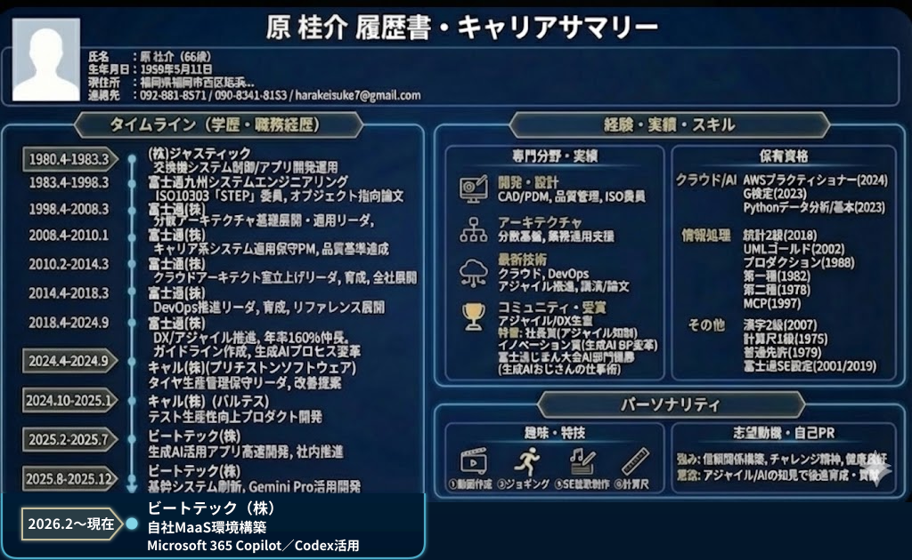

# 5. AI開発事例発表会

## AIは「道具」でなく「相棒」

### 〜アジャイルなAI駆動開発の実践事例〜

この発表では、AIを単なるコード生成ツールではなく、
設計・実装・テストを一緒に進める「相棒」として活用した事例を紹介します。

AIとの短い対話を何度も繰り返し、早くフィードバックを得ることを追求した結果、
チームの開発スタイルは自然にアジャイルへ近づいていきました。
AIは提案や確認を支援し、最終判断と責任は人が持ちます。

---

## 自己紹介

### 原 桂介（Keisuke Hara）

- **所属**：ビートテック株式会社 九州支店
- **担当**：AI時代のエンジニア育成、業務改革
- **主な領域**：アジャイル推進、AI活用推進、クラウド推進
- **現在取り組んでいる技術**：Python／AWS、Vue 3／JavaScript、API Gateway、Lambda、OpenShift／Kubernetes、GuideLLM、生成AI／MaaS／LoRA／RAG／GuradRailなど
- **大切にしている考え方**：「チームの価値は、単位時間あたりに得られるフィードバックの量と質に大きく左右される」

64歳を過ぎてから、Pythonの基礎とデータ分析、
G検定とAWS Certified Cloud Practitionerを取得しました。
苦手だった分野も、独学でAIと対話しながら、
自分なりに少しずつ「偏差値」を上げてきました。

現在のMaaS基盤の仕事も、インフラ領域は未経験からの初挑戦です。
まだつたないところもありますが、学ぶことが多く、
試行錯誤を楽しみながら日々取り組んでいます。

2025年5月から「Viveコーディング」を実践し、
ChatGPTやGeminiと対話しながら**26個のアプリ**を開発しました。
2〜3日で1個のペースで試作と改善を繰り返し、
成果物だけでなく、そこで得たプロセスや気づきも継続的に公開しています。

### 関連サイト

- [開発したアプリ：GameHub](https://toppage-five.vercel.app/)
- [技術・スキル一覧：SkillTrail](https://hara0511skilltrail.vercel.app/)
- [詳しい作者プロフィール](./profile)

---

## 本日の流れ

- **5.1 WHY：考え方と現場の変化**
  - なぜAIを「相棒」と捉え、現場で何が変わったのか
- **5.2 HOW：設計・実装・テストでの実践**
  - AIを開発の流れへどのように組み込むのか
- **5.3 NOW：現在のMaaS（モデル提供サービス）活動（時間があれば）**
  - 閉域環境向けMaaS基盤と、GuideLLM／Excelによるモデル評価自動化

> **AIに仕事を任せる話ではなく、 
> AIと人が共に考え、短いフィードバックループで 
> 提供価値を高めながら総コストを抑える、 
> Vive with Geminiでいう「ROI最大化」を目指す実践事例です。**

👉 [発表を始める：5.1 AIは「道具」でなく「相棒」](./ai-agile-vive-with-gemini-5-1)
