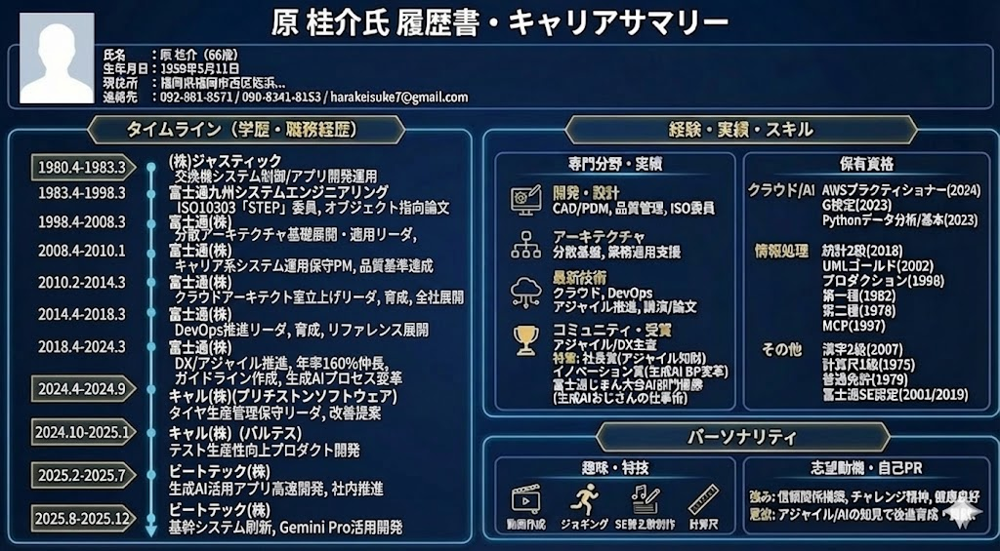

# 5. AI開発事例発表会

## AIは「道具」でなく「相棒」

### 〜アジャイルなAI駆動開発の実践事例〜

この発表では、AIを単なるコード生成ツールではなく、
設計・実装・テストを一緒に進める「相棒」として活用した事例を紹介します。

AIとの短い対話を何度も繰り返した結果、フィードバックの速度が上がり、
チームの開発スタイルが自然にアジャイルへ近づいていきました。

---

## 自己紹介

### 原 桂介（Keisuke Hara）

- **所属**：ビートテック株式会社 九州支店
- **担当**：AI時代のエンジニア育成、業務改革
- **主な領域**：アジャイル推進、AI活用推進、クラウド推進
- **技術領域**：Vue 3、TypeScript
- **大切にしている考え方**：「価値はフィードバックの総量に比例する」

2025年5月から「Viveコーディング」を実践し、
ChatGPTやGeminiと対話しながら**26個のアプリ**を開発しました。
2〜3日で1個のペースで試作と改善を繰り返し、
成果物だけでなく、そこで得たプロセスや気づきも継続的に公開しています。

### 関連サイト

- [開発したアプリ：GameHub](https://toppage-five.vercel.app/)
- [技術・スキル一覧：SkillTrail](https://hara0511skilltrail.vercel.app/)
- [詳しい作者プロフィール](./profile)

---

## 本日の流れ

1. **5.1 AIは「道具」でなく「相棒」**
   - AI駆動開発によって、現場で何が変わったのか
2. **5.2 現場で磨かれるAI活用術**
   - 設計・実装・テストでの具体的な使い方
3. **5.3 現在のAI活動（時間があれば）**
   - エアギャップ環境での社内向けMaaS開発

> **AIに仕事を任せる話ではなく、 
> AIと人が共に考え、短いサイクルで価値を届けるための実践事例です。**

👉 [発表を始める：5.1 AIは「道具」でなく「相棒」](./ai-agile-vive-with-gemini-5-1)
