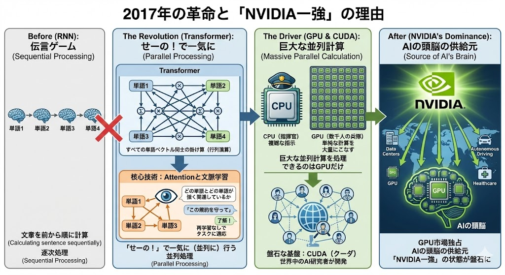
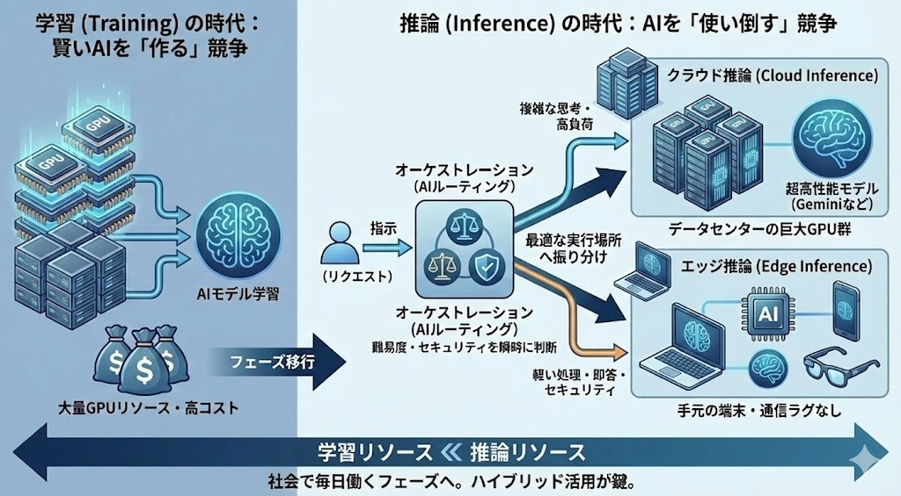

# 【コラム】2015年ころのAIと、今のAIは何が違うのか？

## —— 「道具」から「相棒」へ進化した技術的理由

先日、福岡支店での講演（Vive-with-Gemini）の際、2015年頃からAI開発に携わっていた方から、鋭い質問をいただきました。

> **「今のAIも、結局は過去のデータから相関関係を見ているだけですよね？ 因果関係を理解しているわけではないのに、なぜこれほど『対話』が成立するのですか？」**

この質問は、AI進化の本質を突いています。
2015年当時のAI（ディープラーニング初期）を知る技術者にとって、AIとは「データを分類する『道具』」でした。しかし、今の私たちが実践している Vive-with-Gemini は、AIを「共に考える『相棒』」として扱います。

なぜ、AIは「道具」から「相棒」へと格上げされたのか？
その背景には、<strong>「計算の物理的な質的変化」と「使い方の革命」</strong>がありました。

-----

## 1\. 2015年ころの常識：「相関関係の計算機」

2015年頃、AI（CNNやRNN）は「猫の画像」を見て「猫」と答えることはできましたが、「なぜ猫なのか」を説明することはできませんでした。
当時の認識通り、AIの仕組みは<strong>「統計的な相関関係（パターンマッチング）」</strong>であり、それは現在も変わっていません。

AIは言葉の意味を理解しているわけではありません。すべての言葉を<strong>「Word Embedding（単語埋め込み）」</strong>という技術によって<strong>「ベクトル（数百〜数千次元の数字の列）」</strong>に変換し、ベクトル同士の<strong>「向き（コサイン類似度）」</strong>が近いかどうかで、「意味の近さ」を判定しています。
さらに革新的なのは、この技術が「言葉」と「画像」といった、本来は次元の異なるデータ同士をも繋げたことです。 「猫」という文字と「猫の写真」を同じベクトル空間の座標に変換することで、AIはそれらが「同じ意味（近い座標）」であると計算で理解できます。

この、あらゆるデータを共通の座標で扱う<strong>「ベクトル計算」</strong>こそが、マルチモーダルなAIの実体です。

## 2\. 2017年の革命と「NVIDIA一強」の理由

転機は2017年、<strong>Transformer（トランスフォーマー）</strong>の登場でした。これがすべてを変えました。

それまでのAI（RNN）は、文章を前から順に計算する「伝言ゲーム」でした。
しかしTransformerは、文章中の<strong>すべての単語ベクトル同士の掛け算（行列演算）を、「せーの！」で一気に（並列に）</strong>行う画期的な仕組みでした。

### 核心技術：Attentionと文脈学習

このTransformerの中心にあるのが、**Attention（注意機構）** です。
これは、文章の中の「どの単語」と「どの単語」が強く関連しているかを、あたかも人間が注目するように計算する仕組みです。
この機構のおかげで、AIは再学習をすることなく、プロンプトに入力された情報をその場で理解してタスクに適応する **文脈学習（In-Context Learning）** という能力を手に入れました。私たちがAIに「この規約を守って」と指示するだけで従うのは、この能力のおかげです。

### 盤石な基盤：CUDA（クーダ）

ここでハードウェアの運命が決まりました。この巨大な並列計算を処理できるのは、CPU（指揮官）ではなく、単純な計算を大量にこなすGPU（数千人の兵隊）だけだったからです。

結果として、GPU市場を独占していた**NVIDIA**が「AIの頭脳」の供給元となりました。
さらに重要なのは、彼らがハードウェアだけでなく、**CUDA** という並列計算のためのソフトウェア基盤を長年提供し続けていたことです。世界中のAI研究者がCUDA上で開発を行っていたため、このエコシステムが「NVIDIA一強」の状態を盤石なものにしました。

## 3\. 量が質を変えた：「創発」という現象

さらに、<strong>Scaling Laws（スケーリング則）</strong>という発見がありました。
「GPUを並べてデータと計算量を増やせば増やすほど、AIは賢くなる」という法則です。

この法則の発見は、AI開発の競争ルールを一変させました。「計算量と性能を<strong>両対数グラフ（Log-Log Plot）</strong>にとると、綺麗な直線を描く」つまり、<strong>「今の10倍、100倍の計算リソースを投下すれば、この直線の延長線上でこれだけ性能が向上する」という未来が数学的に予測できるようになったのです。 この確信が得られたため、現在のような世界中の企業が競ってGPUへの巨額投資を行う「物量競争」</strong>が加速することになりました。

そして、その物量の果てに、インターネット上のほぼ全てのテキストを学習させた結果、<strong>「創発（Emergence）」</strong>という現象が起きました。
仕組み上は「次に来る言葉を確率で予測しているだけ」なのに、あたかも<strong>「因果関係を理解し、論理的に推論しているかのような振る舞い」</strong>を獲得したのです。

  * **Before:** 特定タスク専用のモデルを、職人芸で「作る」時代。
  * **After:** すでに博識な巨大モデルに、指示を出して「指揮する」時代。

  

## 4\. 現場での活用技術：RAGとLoRA

この「巨大な汎用脳」を、私たちの現場（Vive-with-Gemini）で「相棒」にするために使われているのが、**RAG**と**LoRA**です。

  * **RAG（ラグ：検索拡張生成＜辞書を持たせる＞）：**
    AIは賢いですが、私たちのプロジェクトのことは知りません。そこで、社内規約や設計書を検索させ、それを「カンニングペーパー」として渡すことで、文脈学習（In-Context Learning）を最大限に活かした<strong>「文脈を知っている相棒」</strong>にします。
  * **LoRA（ローラ：適応学習＜専門教育を施す＞）：**
    巨大なモデル本体（脳）を再学習させるのは数億円以上かかります。そこで、脳の外側に「薄いフィルター（アダプター）」だけをくっつけて、そこだけを学習させる技術です。これにより、低コストで<strong>「チーム専用の性格」</strong>を持たせることができます。

    

## 5\. そして未来へ：「学習」から「推論」の時代

これからのトレンドについて少し触れます。
これまでは、賢いAIを作るための<strong>「学習（Training）」</strong>に大量のGPUが必要とされ、そこにお金が集まっていました。

しかしこれからは、社会に出たAIが毎日仕事をする<strong>「推論（Inference）」</strong>のフェーズに入ります。
私たちがコードを書かせたりレビューをさせたりするたびに、裏側ではGPUが推論の計算を回しています。ここには2つの潮流があります。

1.  **クラウド推論:** Geminiのような超高性能なモデルを、データセンターの巨大なGPU群で動かす。
2.  **エッジ推論:** AI PCやスマートフォンなど、ユーザーの手元の端末（エッジ）で、通信ラグなしにAIを動かす。

さらに今後は、これらが独立して動くだけでなく、ユーザーの指示の難易度やセキュリティ要件を瞬時に判断し、「軽い処理はエッジで即答」「複雑な思考はクラウドへ依頼」といった具合に、最適な実行場所へリクエストを振り分ける<strong>「オーケストレーション（AIルーティング）」</strong>の使い方が重要になります。

Vive-with-Gemini のような対話型開発が一般的になれば、クラウドとエッジをハイブリッドに組み合わせることで、**学習よりも推論のために必要なGPUリソースの方が圧倒的に多くなる**と言われています。
「作る競争」から「使い倒す競争」へ。フェーズは確実に変わっています。

## 6\. 最新動向：NVIDIA一強の終焉？ TPUと「Gemini 3」の衝撃

最後に、直近の非常に重要な動きについて追記します。これまで盤石と思われていた「NVIDIA一強体制」に、明確な地殻変動が起きています。

これまでのAI業界には<strong>「CUDAを使わないと最先端の学習はできない」</strong>という常識がありました。しかし、Googleはその常識を覆し続けています。
次世代モデル（Gemini 3など）の学習において、NVIDIAのGPUではなく、自社開発のAI専用チップである<strong>TPU（Tensor Processing Unit）</strong>を全面的に使用して構築したとされています。

  * **TPUの優位性：** 汎用的なGPUとは異なり、AIの行列演算「だけ」に特化して設計されているため、電力効率と処理速度において圧倒的なパフォーマンスを発揮します。
  * **脱・NVIDIAの連鎖：** この動きはGoogleに留まりません。報道によれば、<strong>Meta（メタ・プラットフォームズ）やAnthropic（アンソロピック）</strong>といった主要プレイヤーも、一部のワークロードをTPUやAWSの独自チップ（Trainium）へ移行する検討や実験を始めているとされています。また、Appleも自社AI（Apple Intelligence）の学習にTPUを利用したことを論文で公表しています。

これまで「AIへの投資＝NVIDIAへの課金（70％以上が粗利）」と等しい状態でしたが、Googleが自社チップだけで世界最高峰のモデル（Gemini 3等）を作り上げた事実は、<strong>「NVIDIAへの依存なしでもトップティアのAIは作れる」</strong>という強力な証明となりました。

2025年以降、AI開発は「ソフトウェアの戦い」だけでなく、「自社シリコン（独自半導体）を持つ者が勝つ」という**ハードウェアの総力戦**へと突入しています。私たちが使う「相棒」の頭脳が、どのチップで動いているのか——そんな裏側のドラマにも注目すると、AIの進化がより立体的に見えてくるはずです。

-----

## 結論：Vive-with-Gemini が「相棒」と呼ぶ理由

2015年のAIは、特定の作業を自動化する優れた「道具」でした。
2025年のAIは、**GPUとCUDA**による計算力を背景に、**Attention機構**で文脈を深く理解し、**RAG**で現場の知識を武装した、頼れる<strong>「相棒」</strong>です。

かつての技術を知る方こそ、この「中身は相関関係の行列計算なのに、振る舞いが人間のような相棒になった」という進化の面白さを、ぜひ現場のペアプロを通じて体感していただければと思います。

-----

## 【次回予告】「賢さ」から「行動」へ —— 進化する相棒の真価

今回は「AIがなぜ賢くなったのか（物理的・技術的背景）」を解説しましたが、次回は<strong>「その賢さが、私たちの現場仕事をどう変えるのか？」</strong>という、さらに踏み込んだ最新機能に迫ります。
キーワードは<strong>「熟考・行動・記憶」</strong>です。

1.  **「直感」から「熟考」へ（推論プロセスの進化）：**
    これまでのAIは即答型（System 1）でした。しかし最新のAIは、回答する前に「一呼吸置いて論理を検証する（System 2）」能力を獲得し始めています。自ら間違いに気づき修正する、「思考するAI」の衝撃とは？
2.  **「対話」から「行動」へ（エージェント化）：**
    ただのチャットボットではありません。AIが自らPCを操作し、コードを実行し、エラーを直す。自律的にタスクを完遂する「エージェント（代理人）」としての働き方が始まります。
3.  **「検索」から「全知」へ（ロングコンテキスト）：**
    RAG（辞書引き）の限界を超える技術。数万行のコードや分厚い仕様書を「まるごと頭に入れて」理解する、Gemini特有の超巨大記憶領域（100万〜200万トークン）がもたらす開発革命について。

「道具」から「相棒」へ、そして<strong>「自律した部下」</strong>へ。
AIとの付き合い方がまたガラリと変わる未来を解説します。お楽しみに。

👉 [前の記事：「現場で磨かれるAI活用術：Vive-with-Gemini実践編」に戻る](https://hara0511vive-with-gemini.vercel.app/ai-agile-vive-with-gemini-extended.html)