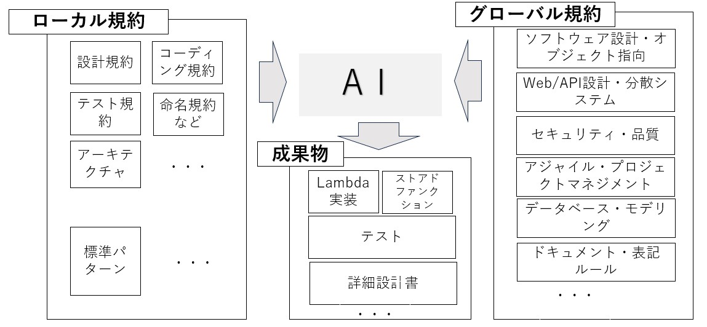

# 現場で磨かれるAI活用術：Vive-with-Gemini実践編（概要）

前回のコラムでは、AIと共に動くチームの中で自然に生まれた  
“会話駆動型アジャイル”の姿を紹介しました。  
今回はそこから一歩踏み込み、現場レベルでAIをどう活用しているのか、  
そのエッセンスを紹介します。  

（※内部設計指針や具体的なコード規約の詳細は守秘義務もありすべては展開できませんが、  
雰囲気を感じ取っていただければ幸いです）

---

💡 AI活用の基本スタンス

AIを「自動化の道具」としてではなく、  
**共に考える相棒**として扱うことが出発点です。  
AIはチームの一員として設計・実装・テストすべての工程に関わり、  
人は常に “意図” と “品質” を確認する立場に立ちます。

AIは確率の世界で「もっともらしい答え」を返している存在です。  
下図のように、**どれくらい広く答えを許すか（自由度＝ばらつき）**を変えることで、  
こちらが期待する役割も変わってきます。

- 左のようにばらつき（σ）が大きい状態：  
  → 発想を広げたいとき（アイデア出し・バリエーション出しなど）に向いている。
- 右のようにばらつき（σ）が小さい状態：  
  → 品質や生産性をしっかり高めたいときに向いている。

そのため、AIを活用するときは

- **アイデア拡散モード**（左図：自由度高め・抽象度高め）  
- **品質・生産性向上モード**（右図：枠組みをはっきり決めて自由度を絞る）

の２つを意識して使い分けます。  

特に後者では、抽象的な指示よりも、アーキテクチャ設計やフレームワーク、命名規則など  
**“枠組みが明確な領域”をきちんと用意し、その中で動いてもらう**ほうが安定します。  

結果として、AIを「自由にさせすぎない」ことが、  
品質と生産性を同時に引き上げるための大事なポイントだと感じています。
---

## 🔧 ローカル規約 × グローバル規約 × AI

私たちの現場では、AIに「ゼロから全部考えさせる」のではなく、  
上の図のように **ローカル規約とグローバル規約を両側から与えたうえで、成果物を一緒に作る** 形をとっています。

- 左側：**ローカル規約** (他社差別化はここの要素)
  - 設計規約、コーディング規約、テスト規約、命名規約、アーキテクチャ指針、標準パターン など  
  - プロジェクト固有の事情・制約・「こう書くと後で困らない」が詰まった社内ルール群

- 右側：**グローバル規約**  
  - ソフトウェア設計・オブジェクト指向、Web/API設計・分散システム  
  - セキュリティ・品質、アジャイル／プロジェクトマネジメント  
  - データベース設計・モデリング、ドキュメント／表記ルール など  
  - 世界中で共有されているベストプラクティスやデファクトスタンダード

- 中央：**AI**  
  - これら両方の「枠組み」を前提としてプロンプトに埋め込み、  
    Lambda実装／ストアドファンクション／テスト／詳細設計書などの**成果物生成を支援する相棒**として使っている。

AIにとっては、右側のグローバル規約は「教科書的な土台」（キーワード程度でうまくやってくれます）、  
左側のローカル規約は「そのプロジェクトならではの味付け」に相当します。  
この二つをセットで渡すことで、**汎用的でありつつ現場にフィットしたアウトプット**を得やすくなります。

こうした前提の上で、実際の開発プロセスの中で  
どのフェーズでどのようにAIを活用しているのかを、以下で整理します。

---

## 🧭 開発現場でのAI活用ポイント（概要）

### 1️⃣ 設計フェーズ：AIによる規範理解と設計レビュー

社内標準やコーディング規約をAIに学習させ、  
設計段階から品質チェックを自動化。  
AIが命名規則・データ構造・例外処理パターンの逸脱を検出し、  
レビュー効率を大幅に向上。  
API仕様とデータ設計の整合性をAIが補助的に検証。  

また、**公的なアーキテクチャパターンやデザイン原則の上に小さな部品を積み上げる**  
“コンポーネント指向”のアプローチを採用しています。  
AIは、こうした一般論や標準パターンといった「教科書的な土台」には特に強く、  
そこにプロジェクト固有の制約やデータ（API定義書、DB設計、命名規約など）を食べさせることで、  
**そのプロジェクトならではの差別化された解**を返してくれるようになります。  

その結果、AIはこの土台を理解したうえでピンポイントな改善提案を行い、  
**全体構造を壊さずに部分最適を進められる**のが大きな強みです。

---

### 2️⃣ 実装フェーズ：パターン化された知識の活用

実際のプロジェクトで蓄積した良質なコードパターンをAIに共有し、  
それをもとに設計情報を入力すると初期コードを自動生成。  
人は生成物の意図・例外ケース・業務ロジックを補完し、  
“8割自動＋2割創造”のリズムで進行。  
開発者同士の議論もAIを交えた設計対話として発展。  

こうした仕組みは、**堅牢なアーキテクチャとAI支援の融合**によってこそ機能します。  
現在のプロジェクトでも、API Gateway＋Lambda パターンを中核とし、  
データアクセス層はストアドファンクションで統制。  
明確な責務分離の上でAIを活用することで、  
**生成結果の整合性・安全性・再利用性が格段に高まっています。**

---

### 3️⃣ テストフェーズ：AIによる自動生成と自己追随

実装コードをAIに解析させ、  
指示（例：「C1条件網羅で」「外部APIはMock環境で」）を与えるだけでテストコードを生成。  
修正後もAIが差分を理解し、テストを自動追随。  

このように、AI生成と人間設計のハイブリッドにより、  
**「1関数＝1テスト単位」＋「parametrizeによる多様ケース対応」＋「共通関数による標準化」**  
という三層構造のテスト設計を確立。  

セーフティネットとしてのテスト資産が“生きたまま”維持され、  
品質保証とアジャイル性を両立したテスト基盤が形成されている。  

今後は、このテスト基盤をそのまま土台として、  
**CI/CD パイプライン上での自動テスト実行～自動デプロイ**までを一気通貫でつなぎ、  
AIが絡んだインクリメンタル開発を継続的に回していくことも視野に入れている。

---

### 4️⃣ チェックフェーズ：人による最終確認

すべてのコード・テストはAIチェックを経たうえで、  
最終判断はあくまで人が行う。  
AIが形式面・整合性を担い、  
人が「この機能は本当に価値があるか？」「業務の意図に合っているか？」という  
**意図と意味を保証する**──この役割分担が、現場の信頼を支える基盤になっている。  

AIによるチェックと人のレビュー、そしてスプリントレビューでの対話を組み合わせることで、  
**品質・価値・学び**の三つを同時に高めていくことを目指している。  

＜補足＞スクラムのスプリントレビューについて、  
よくある誤解は「承認ゲート」だと思われがちな点です。  
本来は「動くもの」をステークホルダーに見せ、  
そこで得られるフィードバックや追加要望などを収集する場です。  
そこで得た気づきが、AIを活用したインクリメンタルな改善サイクルにつながる  
**重要な情報源**となります。

---

## 🌪 ＜補足説明＞フィードバック量とROI最大化のイメージ

上の図は、アジャイル開発を**同心円状のフィードバックループ**として表現したものです。

- 外側：**Strategy / Release**  
- 中側：**Iteration / Sprint**  
- さらに内側：**Daily / Continuous**（TDD・ビルド・リファクタリングなど）  
- すべてのループの矢印が、右下の **Working Software（動くソフトウェア）** に向かっている

まわりには「Values」「Visibility」と書かれていて、  
- 価値観（adaptability, transparency, simplicity ...）  
- 見える化（velocity, burndown, tests ...）  
が、このループを支えていることを示しています。

ここで私たちが大事にしているのは、

> **チームの価値は、「単位時間あたりに得られるフィードバック量」にほぼ比例する**

という考え方です。

- Strategy／Release レベルの大きなフィードバック  
- Sprint／Daily の中くらいのフィードバック  
- TDD／自動テスト／監視ログなどの細かいフィードバック  

これらを**絶えず（-ing）回し続ける**ことで、  
「今やっていることは本当に価値につながっているか？」を  
常に確認しながら進められます。

Vive-with-Gemini の取り組みでは、このフィードバックループの各レイヤーに  
AIを組み込み、**フィードバックの頻度と質を同時に高める**ことを狙っています。

- 上位レベルでは：要件・仕様のすり合わせをAIと一緒に整理し、  
  誤解や抜け漏れを早い段階で潰す。
- 実装レベルでは：設計レビューやテスト生成をAIに支援させ、  
  一つひとつの変更に対する安全網を厚くする。

こうして、

> **ROI = 価値 ÷ コスト**

の観点で見たときに、  
- 「価値」側は、フィードバックの密度を高めてプロダクトの方向性を磨き込み、  
- 「コスト」側は、AIによる自動化と標準化で無駄な手戻りを減らす、

という二正面からのアプローチで、  
**ROI最大化を常に意識したアジャイルな開発サイクル**を回している、  
というのがこの図で伝えたいメッセージです。

## ⚙️ 成果と変化

- チームメンバーが**AIとの会話を軸に作業を進める**文化が定着。  
- コミュニケーションの質が上がり、  
  会議・チャット・設計議論すべてが **思考の共有** になった。  
- 結果として、プロセスは自然にアジャイル化し、  
  自主性とスピードの両立が可能に。  

さらに印象的だったのは、AIが提示する設計思想やコード提案には、  
時に誤りや矛盾が含まれるにもかかわらず、  
**その“半信半疑の対話”こそが自分の理解を深めるきっかけ**になったことです。  

AIの出力を鵜呑みにせず、「なぜそうなるのか」を自分の言葉で咀嚼して取り込む過程が、  
結果的に知識の定着と拡張を生み出しました。  

言い換えれば、**AIの“間違い”も学習資源として活かせる**ようになったことが、  
このプロジェクト最大の知見の一つでした。

---

## 💬 結び

**チームがAIを通してアジャイルに成長していく──  
それが Vive-with-Gemini の実践です。**

---

## 🔗 次回予告（プロジェクト終了後に）

次のコラムでは、ここで触れたAI活用術の具体的な設計・実装パターンを紹介します。

- AIを使ったレビュー自動化のプロンプト設計  
- コード生成と差分検証の実例  
- AI駆動テストの実運用ノウハウ  

現場で磨かれた“泥臭いAI活用”を体系的に整理していきます。
