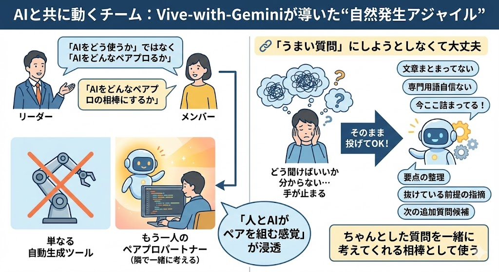
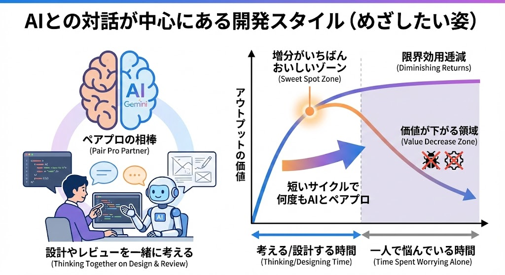
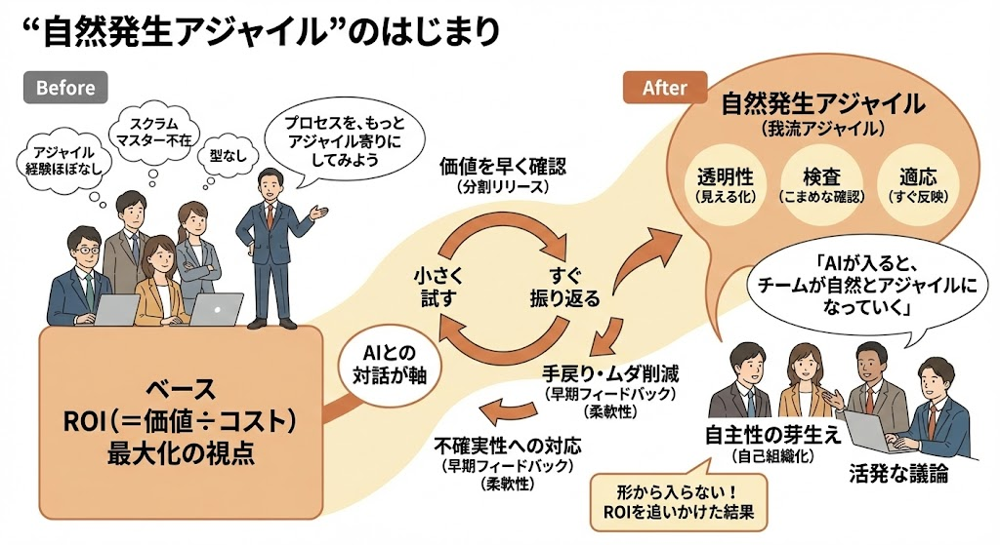

# 九州支店会議＜11月21日資料＞
# 本日の要点：AIは「道具」ではなく「相棒」

## 1. 🧠 マインドセットを変える
* **「自動化ツール」として見ない**
    * AIにただコードを書かせて終わりにするのは、一番もったいない使い方です。
* **「ペアプロの相棒」として接する**
    * 「今ここで詰まっている」「どう思う？」と相談し、一緒に考える**対話の相手（パートナー）**として扱います。

## 2. 🔄 なぜアジャイルになるのか？
* **フィードバックの高速化**
    * 設計・実装・テストの全工程で、AIから即座にフィードバックをもらいます。
* **自然発生的なアジャイル化**
    * 超高速な「会話のキャッチボール」を繰り返すことで手戻りが減り、結果として開発プロセスが自然と**アジャイル（透明性・検査・適応）**な形へと進化します。

## 3. 🚀 明日からできること（自分で使ってみること）
* **うまい質問を作ろうとしなくていい**
    * 完璧なプロンプト（指示文）を練る必要はありません。
* **まずは「相談」から始める**
    * AIを**「新人だけど超優秀な後輩」**だと思って、今の悩みや詰まっている点をそのまま話しかけてみてください。そこから対話が始まります。

# ＜詳細説明＞
# AIと共に動くチーム：Vive-with-Geminiが導いた“自然発生アジャイル”

AI活用開発の現場に参画したとき、最初にチームリーダーと語り合ったのは、  
「AIをどう使うか」ではなく、「AIをどんな**ペアプロの相棒**にするか」でした。  

AIを単なる自動生成ツールとしてではなく、  
自分の隣でコードや設計を一緒に眺めてくれる **もう一人のペアプロパートナー** として扱う。  
その前提を共有できたことで、  
「AIとどう共に考えるか」という視点が、自然と会話の中心になっていきました。

当時、リーダー自身も「この時代、AIとどう協働していくべきか」を模索しており、  
その思いと私の考えが自然に重なった瞬間でもありました。  
その対話をきっかけに、チームの中に徐々に  
「人とAIがペアを組んで開発する」という感覚が浸透していきました。

### 🔗 「うまい質問」にしようとしなくて大丈夫

AI 活用で一番もったいないのは、  
> 「どう聞けばいいか分からなくて、質問する前に手が止まってしまう時間」です。
でも、ペアプロの相棒としての AI は、**質問の荒削りさも含めて補完してくれる存在**だと考えています。
- 文章がまとまっていなくても OK  
- 専門用語が合っていなくても OK  
- 「今こんなことで詰まっている」「このログのどこを見ればいい？」と  
  困っていることをそのまま投げてしまって大丈夫です。

むしろ、  
> **「まずは今の悩みをそのまま AI に投げてみる」**  

ことをスタート地点にした方が、活用の敷居はぐっと下がります。

AI 側に一度ぶつけてみれば、

- 要点の整理（＝本当の問いは何か？）  
- 抜けている前提情報の指摘  
- 次に聞くべき追加質問の候補  

といった形で、AI 自身がこちらの質問づくりを手伝ってくれます。

つまり **「ちゃんとした質問が思いつかないから AI を使えない」ではなく、  
「ちゃんとした質問を一緒に考えてくれる相棒として AI を使う」** という感覚で付き合っていく――  
これが、経験年数に関係なく誰でも AI 活用を始められる、一番やさしい入り口だと感じています。

---

## 1. AIとの対話が中心にある開発スタイル（めざしたい姿）

Vive-with-Gemini では、AIを単なる自動生成ツールではなく、  
設計やレビューを一緒に考えてくれる **ペアプロの相棒** として扱えるチームをめざしています。

図の右側にあるカーブは、いわゆる **限界効用逓減（diminishing returns）** のイメージです。  
横軸を「考える／設計する時間」や「一人で悩んでいる時間」、縦軸を「アウトプットの価値」とすると、

- 最初のうちは時間をかけるほど価値は大きく伸びるが  
- あるポイントから先は、時間を追加しても **価値の伸びが小さくなる**  
- 行き過ぎると、むしろ手戻りや複雑化で **価値が下がる領域** に入ってしまう  

ということを表しています。

そこで私たちは、グラフの「増分がいちばんおいしいゾーン」で AI と会話（壁打ち）することを意識しています。  
一人で長時間悩み続けるのではなく、**短いサイクルで何度もAIとペアプロすることで、  
限界効用逓減に入る前に価値を取りきる**──そんな開発スタイルを狙っています。

ここでいう「会話中心」とは、紙やツール上のドキュメントを捨てることではありません。  
従来の設計書や仕様書に加えて、  
**AIとの対話ログそのものが「生きた設計書」として機能する状態** を目指しています。  

プロジェクト稼働中の問いや検討の履歴が対話ログとして蓄積され、  
それが常に **動的に更新・改善され続けるナレッジベース** になっていく。  
そんな姿が実現できれば、固定化されたドキュメントだけに頼るのではなく、  
**“考えながら作り続ける”プロセスそのものが設計活動** になっていきます。  

仕様書も対話ログも「どちらが正」と決めるのではなく、  
互いに補完しながら最適な形に “進化し続けている”──  
そうした状態を、このプロジェクトのひとつのゴールイメージとしています。  

> 💬 *「AIと話しているうちに、チームも対話的になっていく」*  
> そんなチームでありたい、というのが出発点の願いでした。  

このビジョンは、まさに **アジャイルマニフェストの原点** とも響き合います。  
> 「プロセスやツールよりも、個人と対話を」  
> 「計画に従うことよりも、変化への対応を」  

AIとの協働を通じて、  
**人とAIの間に“継続的な対話”が生まれ、その中で柔軟に変化へ適応していけるチーム** になりたい。  
そして、その営みが結果として、現場の中に “自然発生的なアジャイル” を育てていく──  
そんな未来像を描きながら、このプロジェクトを進めています。  

下図のように、プロダクトオーナー（自分）が真ん中に立ち、  
左側のステークホルダーと右側の複数のAI「専門家」と対話を繰り返すことで、  
**対話ログ＝生きた設計書** が育ち、リファインメントの質とスピードが同時に高まっていく。  
AIは「追加のチームメンバー」として仕様理解や整理を支援し、  
人はその結果を踏まえて価値や優先度を判断する──  
このような役割分担が、ROI 最大化につながるアジャイルな開発スタイルの理想形だと考えています。

---

## 2. “自然発生アジャイル”のはじまり

このプロジェクトのメンバーは、もともと本格的なアジャイル経験がほとんどありませんでした。  
スクラムマスターもいなければ、典型的なスクラムイベントの型を一式そろえていたわけでもありません。

私が参加して1か月ほど経った頃、  
リーダーから「プロセスを、もっとアジャイル寄りにしてみよう」という一言がありました。  
ここで合言葉になったのは、**「アジャイルをやる」のではなく「アジャイルになる」** でした。

そのときのベースにあったのは、フレームワークではなく  
**ROI（＝価値 ÷ コスト）をどう最大化するか** という視点です。

- 価値を早く確認するには、どう分割してリリースすればいいか  
- 手戻りやムダな作業コストを減らすには、どのタイミングでフィードバックをもらうべきか  
- 仕様の揺れや不確実性に、どうやって柔軟に対応するか  

こうした問いに向き合いながら、  
AIとの対話を軸に「小さく試す → すぐ振り返る」を繰り返していった結果、  
**気づけばアジャイルの本質（透明性・検査・適応）に近いプロセスへと自然に寄っていった**──  
というのが実感に近い流れです。

ここで大事にしたのは、  
まず「デイリースクラムをやろう」「この順番でイベントを回そう」と **形から入ることではない** という点でした。  
ROI 最大化という土台から考えると、

- 作業内容と進捗を見える化し（透明性）  
- こまめに結果を確認し（検査）  
- その学びをすぐにプロセスへ反映する（適応）

という動き方「以外の選択肢」が、ほとんど残らなくなっていきます。  
その結果として、スプリント計画やレトロスペクティブに近い場が生まれ、  
**「スクラムの型を真似した」のではなく、「ROIを追いかけていたらアジャイルな振る舞いになっていた」**  
という順番でプロセスが変化していきました。

現在はまだ “我流アジャイル” の段階ですが、  
メンバー一人ひとりに自主性が芽生え（自己組織化の始まり）、  
チャットや会議での議論が以前よりも格段に活発になりました。  

> 💬 *「AIが入ると、チームが自然とアジャイルになっていく」*  
> この現象は、私自身にとって大きな発見でした。

---

### 🔗 関連リソース：アジャイルをもっと知るための3つの“地図”

アジャイルの思想や実践を、より直感的に理解したい方におすすめの3選です👇

1. 🎥 **Agile Product Ownership in a Nutshell**（16分動画）  
   https://www.youtube.com/watch?v=502ILHjX9EE  
   → プロダクトオーナー視点で「なぜアジャイルが価値を生むのか」を軽快に解説。  

2. 📘 **スクラム公式ガイド（日本語版PDF）**  
   https://scrumguides.org/docs/scrumguide/v2020/2020-Scrum-Guide-Japanese.pdf  
   → アジャイルの中核であるスクラムの原典。薄くて本質的で、辞書代わりに最適。  

3. 🗺️ **富士通：アジャイル特集ページ**  
   https://www.fujitsu.com/jp/services/agile/featurestories/  
   → 日本企業の現場事例を交え、アジャイルがどのように組織文化へ浸透するかを紹介。  

---

## 3. Vive-with-Gemini の理念が現場でかたちになった

Vive-with-Gemini が掲げる理念は、**「AIと共に考え、共に成長する」**。  
今回の経験を通して、その思想が現場で静かに根を下ろしていくのを感じました。  

AIを導入したからアジャイルになったのではありません。  
むしろ、**「チーム（プロダクト）の ROI をどう最大化するか」** を考え抜いていった結果、  
自然とアジャイルな進め方にたどり着いた、というのが実感に近いです。  

上の図のように、ステークホルダーとアジャイルチームの間に立つ PO が、  
人と複数の AI「専門家」と対話を重ねながらリファインメントを回していくことで、  
**価値（Value）を高めつつ、余計なコストを抑え、ROI＝価値 ÷ コスト を押し上げていく**──  
そんな開発スタイルを目指しています。  

AIとの“共感的な対話”を通じて、  
メンバーが自ら動き、学び合う文化が生まれた──  
そのプロセスこそが Vive-with-Gemini の本質だったのです。  

> 💬 *AIはチームを変えたのではなく、チームがAIを通して変わっていった。*

---

## 4. AIが導く「会話駆動型アジャイル」まとめ

今、チームの会話には以前よりもはっきりとした変化が見えてきています。  
立場や役割を越えてアイデアや気づきが自由に飛び交い、  
その輪の中には、自然な形でAIも混ざるようになってきました。  

まだ「完成されたアジャイルチーム」ではありませんが、  
メンバー全員が **「よりよく価値を届けるにはどうするか」** という方向を向き始め、  
少しずつ、しかし確実にアジャイルなあり方へと歩みを進めている──  
その途中経過にいる、という感覚に近いです。

この経験を通じて感じているのは、  
**AIをうまく取り入れようとするチームは、結果としてアジャイルな方向へ成長していく** ということです。  
なぜなら、AIとの対話そのものが、「仮説を立てる → 試す → 振り返る」という  
アジャイルのサイクル（仮説・検証・改善）を日常的に回すきっかけになるからです。  

Vive-with-Gemini が目指してきた「AIと共に歩む開発様式」は、  
今まさに、チームの中で **“なりたい姿” として共有され、文化として育ちつつある段階** にあります。  

> 💬 *AIがチームを速くしたのではない。  
> チームがAIと共に“対話できる組織”になろうとし続けた結果、  
> その方向に向かって成長しているのだ。*

---

## 🔗 次回予告（2025-10-22作成済）

このコラムで描いた「AIと共に動くチーム」の背景には、  
実際の開発現場で積み上げられた数多くの **AI活用ノウハウ** があります。  
次回は、その “泥臭い実践編” を紹介します。  

👉 [次回：「現場で磨かれるAI活用術：Vive-with-Gemini実践編」へ続く](./ai-agile-vive-with-gemini-extended)
