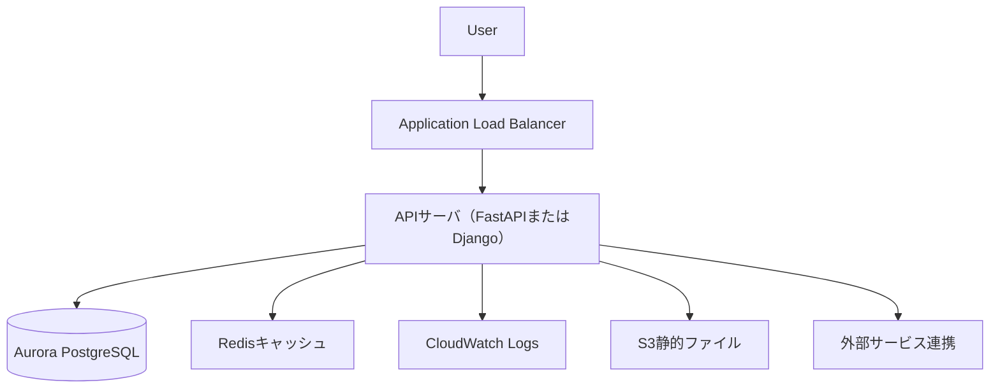

# Django vs FastAPI + AWS (Aurora) によるAPI構築比較ドキュメント

基幹システムと外部サービスを連携するAPI設計において、DjangoとFastAPIを比較し、AWS（Aurora PostgreSQL）上での構築に適したアーキテクチャを提案します。

---

## 🔍 比較表：Django vs FastAPI

| 項目        | Django          | FastAPI               | 備考                        |
| --------- | --------------- | --------------------- | ------------------------- |
| フレームワーク   | フルスタック          | 軽量・API特化              | API専用用途ならFastAPIが有利       |
| 実行速度      | 遅め（同期）          | 高速（非同期）               | 高トラフィック時にFastAPIが強い       |
| DB接続      | Django ORM      | SQLAlchemy / SQLModel | Aurora PostgreSQL 両者対応可   |
| 認証認可      | Session, CSRF対応 | JWT, OAuth2のAPI実装に特化  | 外部API向きはFastAPI           |
| 管理UI      | 標準Adminあり       | なし                    | Web UI必要ならDjango          |
| APIドキュメント | なし（手動）          | 自動（OpenAPI/Swagger）   | APIドキュメントを整備しやすいのはFastAPI |
| テスト       | Django TestCase | pytest対応              | 両者実施可                     |
| Docker運用  | EC2など従来構成向け     | 軽量、Lambda向き           | モダンインフラはFastAPIに好適        |
| 外部API連携   | 同期（requests）    | 非同期（httpx）            | API間連携では非同期のFastAPIが優位    |
| 静的リソース管理  | 一体管理可能          | S3と分離構成前提             | クラウド分離前提ならFastAPI向き       |
| コスト       | サーバ維持費高め        | サーバレス構成可能で安価          | Lambda, Fargateと親和性高い     |

---

## ☁️ AWS構成イメージ

---

## 🎯 適材適所の判断基準

### ✅ FastAPI が向いているケース

* 高速・高並列な非同期APIが求められる
* サーバレス（Lambda）や軽量Fargate構成でコスト最適化したい
* OpenAPIドキュメントを自動生成したい
* 外部API連携が多く非同期処理が必要
* 管理画面やUIは不要

### ✅ Django が向いているケース

* 管理画面やログインUIも一体開発したい
* フルスタックな機能が便利
* 社内チームにDjangoスキルがある
* セッション管理など従来型Webアプリに近い構成が必要

---

## 🔐 セキュリティ・運用上の考慮点（共通）

1. **JWT認証・OAuth2** による認可
2. **API Gateway** + IP制限/WAF設定
3. **Redisによるキャッシュ** ＆ 非同期アクセス
4. **ログ監視**：CloudWatch連携 or ELK
5. **ヘルスチェック / フォールバック / リトライ処理**
6. **OpenAPIによる仕様管理** + モック環境での検証
7. **認証キーのSecret Manager管理**
8. **CI/CDの自動化（GitHub Actions, AWS CodePipeline）**
9. **TerraformなどによるIaC（Infrastructure as Code）運用**

---

## 📝 備考

* FastAPIの方が軽量かつ疎結合なAPI設計に最適。
* Djangoは一体型開発が可能でUI付きサービスには強み。
* AWS Aurora（PostgreSQL）はどちらのORMからも接続可能。
* インフラ規模や連携要件、開発チームのスキルセットで判断することが重要です。

---

