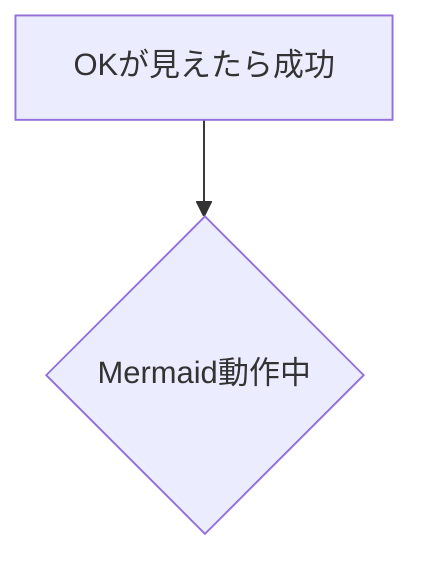

# Mermaid × VitePress チートシート

（日本語ラベル・API Gateway・PostgreSQL を Docker で表現する例つき）

> このページは「VitePressでMermaidを確実に描画する」ための実用メモです。
> *Mermaid 10.9.x / VitePress 1.x 想定。*

---

## 0. まずは最小セットアップ

### 0-1. どちらか好きな描画方式を選ぶ

**A) `<pre class="mermaid" v-pre>` を使う（あなたの環境で安定）**

```html
<pre class="mermaid" v-pre>
flowchart TD
  A[OKが見えたら成功] --> B{Mermaid動作中}
</pre>
```

**B) トリプルバッククォート \`\`\`mermaid を使う（VitePress側のMermaid内蔵を使う）**

> こちらは VitePress のバージョンや設定によっては効かないことがあるので、
> 現状は A) を推奨します。



### 0-2. SPA遷移で図がテキストのままになる対策（自動再レンダリング）

`docs/.vitepress/config.ts` の `head` に入れておくと、ページ切替後に自動で再描画されます。（あなたのプロジェクトでは既に導入済みのロジックに近い形です）

```ts
head: [
  [
    'script',
    { type: 'module' },
    `
import mermaid from 'https://cdn.jsdelivr.net/npm/mermaid@10/dist/mermaid.esm.min.mjs';

// 1回だけ初期化
if (!window.__MERMAID_INIT__) {
  mermaid.initialize({ startOnLoad: false, securityLevel: 'loose' });
  window.__MERMAID_INIT__ = true;
}

const render = () => {
  try { mermaid.run({ querySelector: '.mermaid' }); } catch {}
};

// 初回
if (document.readyState !== 'loading') requestAnimationFrame(render);
else window.addEventListener('DOMContentLoaded', () => requestAnimationFrame(render));

// ルート遷移後（サイドバークリックなど）
window.addEventListener('vitepress:afterRouteChanged', () => {
  requestAnimationFrame(() => requestAnimationFrame(render));
});
    `
  ]
]
```

---

## 1. 基本文法（日本語ラベルのコツつき）

### 1-1. ノード（箱）の種類

```html
<pre class="mermaid" v-pre>
flowchart LR
  A[角丸長方形] --> B(楕円)
  B --> C[[サブルーチン]]
  C --> D[(データベース/円筒)]
  D --> E((丸))
  E --> F>スタジアム形状]
</pre>
```

* `A[Text]` … 角丸長方形
* `B(Text)` … 楕円
* `C[[Text]]` … サブルーチン（両側の角が切れた形）
* `D[(Text)]` … **データベース（円筒）** ← PostgreSQL でよく使う
* `E((Text))` … 円
* `F>Text]` … スタジアム

### 1-2. サブグラフ（グルーピング）

**日本語ラベルを安全に描くには「ノードID + 角カッコ」の形にするのが実践的**です。
`subgraph edge["API Gateway (Nginx)"]` のように **角カッコ＋引用符** を使うとパースエラーを避けやすいです。

```html
<pre class="mermaid" v-pre>
flowchart TD
  subgraph users["ユーザー"]
    C1[クライアント／ブラウザ]
  end

  subgraph edge["API Gateway (Nginx)"]
    GW["認証(API Key)／CORS／速度制限／ロギング"]
  end

  subgraph app["アプリケーションサーバー"]
    API[FastAPI]
  end

  C1 -->|"HTTPS"| GW --> API
</pre>
```

### 1-3. エッジ（矢印）とラベル

* 基本は `A --> B`（実線）、`A -.-> B`（点線）
* ラベルは `A -->|"日本語OK"| B` のように **パイプ`|...|`** で挟む
* ラベルに `/` や `:` を含めても OK。ただし **日本語 + 記号** が混ざるときは `|"..."|` を使う

```html
<pre class="mermaid" v-pre>
flowchart LR
  A[Client] -->|"GET /api/items"| B[API]
  B -.->|"非同期通知 (SQS)"| C[Worker]
</pre>
```

### 1-4. 日本語ラベルでハマりやすい点

* サブグラフ行の直後にコメント `%%` を置くと失敗することあり → **別行に書く**
* `:` や `()`、`/` を混ぜた日本語ラベルは **`|"..."|`** でくくる
* 日本語 + ASCII の混植で意味不明エラーの時は、**ノード側を `ID["ラベル"]` 形式**にすると安定

---

## 2. API Gateway（Nginx）入りの同期/非同期フロー例

```html
<pre class="mermaid" v-pre>
flowchart TD
  %% ===== サブグラフ =====
  subgraph users["ユーザー"]
    Client[クライアント／ブラウザ]
  end

  subgraph edge["API Gateway (Nginx)"]
    GW["認証(API Key) ／ CORS ／ 速度制限 ／ ロギング"]
  end

  subgraph app["アプリケーションサーバー"]
    API[FastAPI API サーバー]
    Worker[ワーカー（非同期処理）]
    BL[ビジネスロジック]
  end

  subgraph ext["外部サービス"]
    DB[(PostgreSQL)]
    SQS[Amazon SQS（キュー）]
    LOG["ログ／メトリクス／トレース基盤"]
  end

  %% ===== 同期（実線） =====
  Client -->|"HTTPS"| GW -->|"正当なリクエストを転送"| API
  API -->|"直接呼び出し"| BL -->|"読み書き"| DB
  BL -->|"結果"| API -->|"JSON"| Client

  %% ===== 非同期（点線） =====
  API -.->|"キュー投入"| SQS
  SQS -.->|"ポーリング・受信"| Worker -.->|"処理依頼"| BL
  API -.->|"アクセスログ／メトリクス"| LOG

  %% 体裁
  classDef dashed stroke-dasharray:4 3,opacity:0.9;
  class API,BL,Worker,DB,SQS dashed
</pre>
```

---

## 3. PostgreSQL を **Docker** で表現する方法

### 3-1. 「イメージ」と「コンテナ」と「永続ボリューム」を描き分ける

* **イメージ**：変更不可のビルド成果物 → `[[postgres:16 image]]`（サブルーチン形）で表現
* **コンテナ**：実行体 → 角丸長方形 `PG[Postgres コンテナ]`
* **データベース**：円筒 `DB[(PostgreSQL)]`
* **永続ボリューム**：`VOL[(Volume/PVC)]` を別ノードで

```html
<pre class="mermaid" v-pre>
flowchart LR
  subgraph registry["レジストリ／イメージ保管"]
    IMG[[postgres:16 イメージ]]
  end

  subgraph node["コンテナ実行ノード"]
    PG[Postgres コンテナ]
  end

  VOL[(Volume/PVC)]:::storage
  DB[(PostgreSQL)]:::db

  IMG -->|"pull"| PG -->|"起動／マウント"| VOL
  PG -->|"接続"| DB

  classDef storage fill:#fff8dc,stroke:#d4a,stroke-dasharray:4 3;
  classDef db fill:#eef,stroke:#88a,stroke-width:2px;
</pre>
```

### 3-2. 「Docker上のPostgreSQL」をアプリ構成に組み込む

```html
<pre class="mermaid" v-pre>
flowchart TD
  subgraph app["アプリケーションサーバー"]
    API[FastAPI]
  end

  subgraph docker["Docker ホスト"]
    subgraph pg["PostgreSQL on Docker"]
      PG[Postgres コンテナ]
      VOL[(Volume/PVC)]:::storage
      DB[(PostgreSQL)]:::db
      PG --> VOL
      PG --> DB
    end
  end

  API -->|"SQLAlchemy/psycopg"| DB

  classDef storage fill:#fff8dc,stroke:#d4a,stroke-dasharray:4 3;
  classDef db fill:#eef,stroke:#88a,stroke-width:2px;
</pre>
```

> **表現の指針**
>
> * **DB本体**は円筒 `[(text)]` を使うと一目で伝わる
> * **コンテナ**は角丸長方形、**イメージ**は `[[...]]` や別サブグラフで
> * **永続ボリューム**を別ノードにし、**コンテナ→Volume** を線で繋ぐと運用の意図が分かりやすい

---

## 4. スタイル＆クラスの活用（見やすくする）

```html
<pre class="mermaid" v-pre>
flowchart LR
  A[同期] --> B[API]
  A -.-> C[非同期]

  classDef sync fill:#e7fff2,stroke:#26a69a,stroke-width:2px;
  classDef async fill:#f7f7ff,stroke:#7e57c2,stroke-dasharray:4 3;

  class A,B sync
  class C async
</pre>
```

---

## 5. ありがちエラーと対策

| 症状                        | 原因                     | 対策                                              |   |           |     |              |        |       |                |
| ------------------------- | ---------------------- | ----------------------------------------------- | - | --------- | --- | ------------ | ------ | ----- | -------------- |
| `Parse error on line ...` | サブグラフ名やノード名に日本語＋記号が混ざる | `subgraph id["日本語ラベル"]` の **角カッコ＋引用符** を使う      |   |           |     |              |        |       |                |
| パイプ \`                    | \` を含んだラベルで失敗          | \`A -->                                         | A | B`を`A --> | "A" | B\` にせず書いている | \*\*\` | "..." | \`\*\* でラベルを囲む |
| SPA遷移後に図がテキストのまま          | Mermaid 自動描画が1回しか走らない  | `vitepress:afterRouteChanged` で **再レンダリング** を呼ぶ |   |           |     |              |        |       |                |
| たまに一部だけ描けない               | DOM がまだ差し替え途中          | `requestAnimationFrame` を **2回** ネストして遅延実行      |   |           |     |              |        |       |                |

---

## 6. 仕上げ：API Gateway + FastAPI + PostgreSQL(Docker) ミニ構成図

```html
<pre class="mermaid" v-pre>
flowchart TD
  subgraph users["ユーザー"]
    C[ブラウザ / WebApp]
  end

  subgraph edge["API Gateway (Nginx)"]
    GW["認証(API Key) / CORS / 速度制限 / ロギング"]
  end

  subgraph app["アプリケーションサーバー"]
    API[FastAPI]
  end

  subgraph infra["データ層（Docker）"]
    subgraph pg["PostgreSQL on Docker"]
      PG[Postgres コンテナ]
      VOL[(Volume/PVC)]:::storage
      DB[(PostgreSQL)]:::db
      PG --> VOL
      PG --> DB
    end
  end

  C -->|"HTTPS"| GW --> API
  API -->|"SQLAlchemy/psycopg"| DB

  classDef storage fill:#fff8dc,stroke:#d4a,stroke-dasharray:4 3;
  classDef db fill:#eef,stroke:#88a,stroke-width:2px;
</pre>
```

---

## 7. 参考

* Mermaid 公式: [https://mermaid.js.org/](https://mermaid.js.org/)

  * Flowchart 形状一覧: [https://mermaid.js.org/syntax/flowchart.html](https://mermaid.js.org/syntax/flowchart.html)
* VitePress 1.x: [https://vitepress.dev/](https://vitepress.dev/)

---

### 付録：最小の `config.ts` 例（必要なら）

> **サイドバー等はあなたの既存設定のままでOK**。
> 図の自動再描画だけ入れたい場合は次の `head` だけ差し込めば足ります。

```ts
// .vitepress/config.ts
import { defineConfig } from 'vitepress';

export default defineConfig({
  title: 'Docs',
  description: 'Mermaid × VitePress',
  head: [
    [
      'script',
      { type: 'module' },
      `
import mermaid from 'https://cdn.jsdelivr.net/npm/mermaid@10/dist/mermaid.esm.min.mjs';
if (!window.__MERMAID_INIT__) {
  mermaid.initialize({ startOnLoad: false, securityLevel: 'loose' });
  window.__MERMAID_INIT__ = true;
}
const render = () => { try { mermaid.run({ querySelector: '.mermaid' }); } catch {} };
if (document.readyState !== 'loading') requestAnimationFrame(render);
else window.addEventListener('DOMContentLoaded', () => requestAnimationFrame(render));
window.addEventListener('vitepress:afterRouteChanged', () => {
  requestAnimationFrame(() => requestAnimationFrame(render));
});
      `
    ]
  ]
});
```

---

