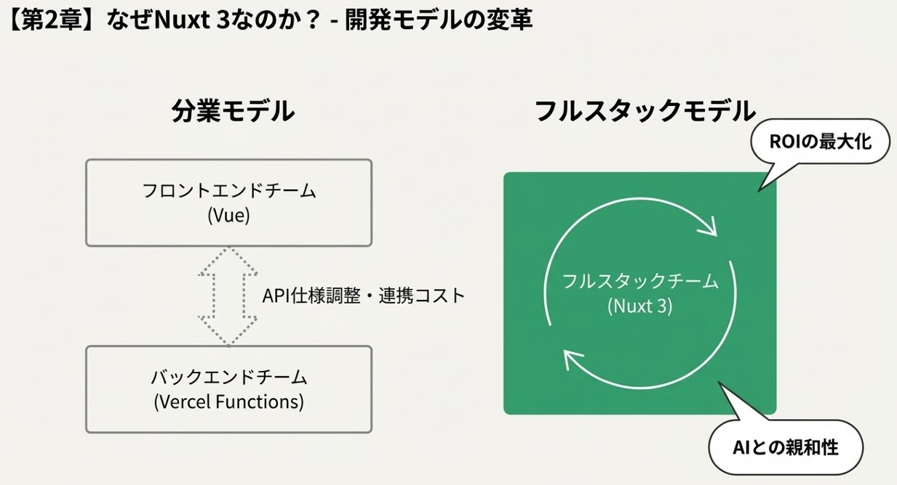
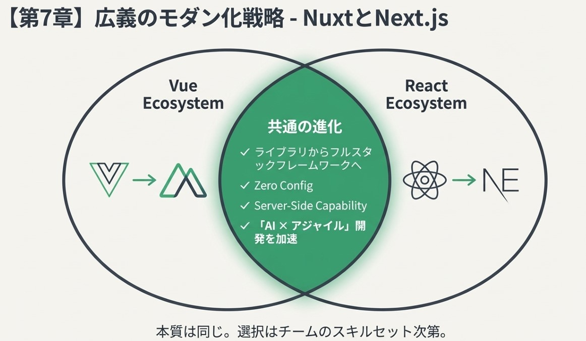

# Vue3 → Nuxt3 マイグレーションガイド：Toppage 移行事例と次世代開発戦略

## 1. 概要


本ドキュメントは、既存の Vue 3 スタンドアロンアプリケーション（Toppage プロジェクト）を、モダンなフルスタックフレームワークである **Nuxt 3** へマイグレーションする際の実践ガイドです。

単なる技術的な置き換えに留まらず、**「AI × アジャイル」** を最大化するための開発基盤の再構築を目的としています。


## 2. なぜ今、Nuxt 3 (フルスタック) なのか？

### 2.1 分業から「1チーム・フルスタック」への変革

これまでの開発は「フロントエンド」と「バックエンド」を別チーム・別リポジトリで分業するのが一般的でした。しかし、Nuxt 3 のようなフルスタックフレームワークの導入により、この境界線が消失します。

* **AI × アジャイルの親和性**: AI（Gemini等）を活用した開発では、フロントからDB連携までを一気通貫で指示・実装できる環境が理想的です。
* **ROIの最大化**: チーム内でフロント・バックの調整コストがゼロになり、ビジネス要求に対して臨機応変に、最短距離で価値を提供することが可能になります。
* **結論**: これからの主流は「分業」ではなく、**1チーム内で全てが完結する AI 駆動型開発** です。Nuxt 3 はそのための最強の「相棒」となります。


---

## 3. Toppage プロジェクトにおける移行の実践

### 3.1 ディレクトリ構造の変化

既存の `src/` 構成から、Nuxt 3 標準のディレクトリ構造へ移行しました。

* **`components/`**: 自動インポート機能により、面倒な `import` 文が不要になりました。
* **`server/api/`**: これまで外部（Vercel Functions 等）に切り出していた DB 操作ロジックをプロジェクト内に統合。
* **`nuxt.config.ts`**: 環境変数（Supabase 等）を安全かつ一元的に管理。


### 3.2 Supabase 連携の最適化

Nuxt モジュール（`@nuxtjs/supabase`）を活用し、フロント・バック両面での接続を安定化させました。

* **サーバーサイド**: `serverSupabaseClient(event)` を使用し、API ルートでの DB 操作をセキュアに実装。
* **フロントエンド**: `useFetch` にユニークな `key` を指定することで、複数コンポーネント間でのキャッシュ競合を解決。


---

## 4. 具体的なマイグレーション・ステップ

### STEP 1：プロジェクトの初期化と環境構築

Windows 環境から Ubuntu (WSL) 等の Linux 環境へ移行する際は、OS 依存のバイナリ整合性に注意が必要です。

```bash
# 既存の node_modules をリセット（OS依存エラーの回避）
rm -rf node_modules package-lock.json
npm install

```

### STEP 2：API ルートへのロジック移管

フロントエンドに書いていた DB 操作を `server/api/*.ts` へ移します。

```typescript
// server/api/get-count.ts の例
import { serverSupabaseClient } from '#supabase/server'

export default defineEventHandler(async (event) => {
  const supabase = await serverSupabaseClient(event)
  const { data } = await supabase.from('page_views').select('*')
  return data
})

```

### STEP 3：Vercel デプロイ設定の変更

ここが移行成功の鍵となります。

1. **Framework Preset**: `Nuxt.js` を選択。
2. **Root Directory**: `nuxt-app`（またはプロジェクトのディレクトリ名）を明示的に指定。
3. **Environment Variables**: `SUPABASE_URL` / `SUPABASE_KEY` を Vercel 側に登録。


---

## 5. 学びと気づき：2026年の開発スタイル

Toppage プロジェクトの移行を通じて、以下のことが明確になりました。

1. **FW が煩わしさを吸収**: ファイルベースルーティングや状態管理の自動化により、開発者は「機能（ロジック）」そのものに集中できるようになりました。
2. **「相棒」としてのAI活用**: Nuxt 3 の一貫した構造は AI にとっても理解しやすく、ペアプログラミングの精度が飛躍的に向上しました。
3. **未来の選択肢**: 新規プロジェクトはもちろん、既存資産のリプレースにおいても、バックエンドを Node.js (TypeScript) に集約し、フルスタック化することは、資産流用と開発速度の両面で「一択」の正解と言えます。


---

## 6. 付録：トラブルシューティング

* **「Error」表示が消えない**: API が期待するパラメータ（`field=views` 等）とフロント側の `useFetch` が合致しているか確認してください。
* **デプロイ後に画面が変わらない**: Vercel の Root Directory 設定を再確認し、ビルドログで Nuxt が正しくビルドされているかチェックしてください。

---
ドキュメントの構成としては、現在の `migration-vue3-to-nuxt3.md` に**「第7章：広義のモダン化戦略」**として統合するのがベストです。これにより、単なる「Toppageの移行手順書」ではなく、**「技術選定とリプレースの指針」**としての価値が生まれます。

ご提示いただいた2つの視点を踏まえ、以下のように拡充内容を構成しました。


## 7. 広義のモダン化戦略とリプレースパターン

### 7.1 Nuxt 3 と Next.js のパラレル関係

Vue 3 から Nuxt 3 への移行は、React エコシステムにおける **React (Vite) から Next.js への移行**と本質的に同義です。

* **共通の進化**: どちらも「ライブラリ（表示）」から「フレームワーク（機能）」への進化であり、以下の共通メリットを享受できます。
* **Zero Config**: ルーティングやビルド設定の標準化。
* **Server-Side Capability**: エッジネットワーク（Vercel 等）での高度な実行環境。


* **選択の指針**: どちらも「1チームでの AI×アジャイル開発」を加速させるツールであり、既存資産やチームのスキルセット（Vue か React か）に応じて選択します。



### 7.2 既存資産（C# / SQL Server 等）を活かした移行パターン

現行の基幹システム（販売管理等）のリプレースにおいて、全てのバックエンドを Node.js に置き換えるのが正解とは限りません。特に **C# + SQL Server + Azure** といった堅牢な資産がある場合は、以下の **「ハイブリッド型」** の移行が現実的かつ高効率です。

#### **移行パターン：API Gateway としてのフルスタック活用**

1. **現行資産の API 化**:
* 既存の C# ロジックを ASP.NET Core API 等でラップし、データアクセス層として存続させます。


2. **Nuxt / Next による「フロント＋中間層」の構築**:
* **BFF (Backend For Frontend)** として Nuxt/Next を採用します。
* ブラウザから直接 C# サーバーを叩くのではなく、Nuxt の `server/api` を経由させます。


3. **メリット**:
* **資産の有効活用**: 複雑なビジネスロジックが詰まった C# 資産を再利用し、リスクを低減できます。
* **UI の高速化**: フロントエンド側は Nuxt の恩恵を受け、モダンで高速なユーザー体験を提供できます。
* **AI 駆動開発の適用**: 変更頻度の高い UI 周りは AI×アジャイルで Nuxt 側を高速に回し、データ層（C#）は堅牢に維持するという「速度の使い分け」が可能になります。


---

## 8. 結論：リプレースにおける ROI の考え方

新規作成であれば **「Nuxt / Next 一択」** ですが、大規模な既存リプレースでは **「バックエンド（C# 等）を資産流用として残し、フロントエンド層をフルスタックフレームワークでラップする」** という選択肢が、コスト対効果（ROI）を最大化させる最短距離となります。


これにより、開発チームは「AI × アジャイル」による柔軟性を手に入れつつ、基幹システムの信頼性を担保し続けることができます。

---

