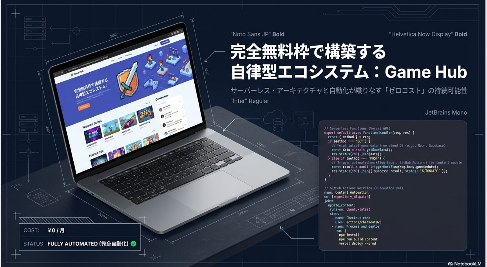
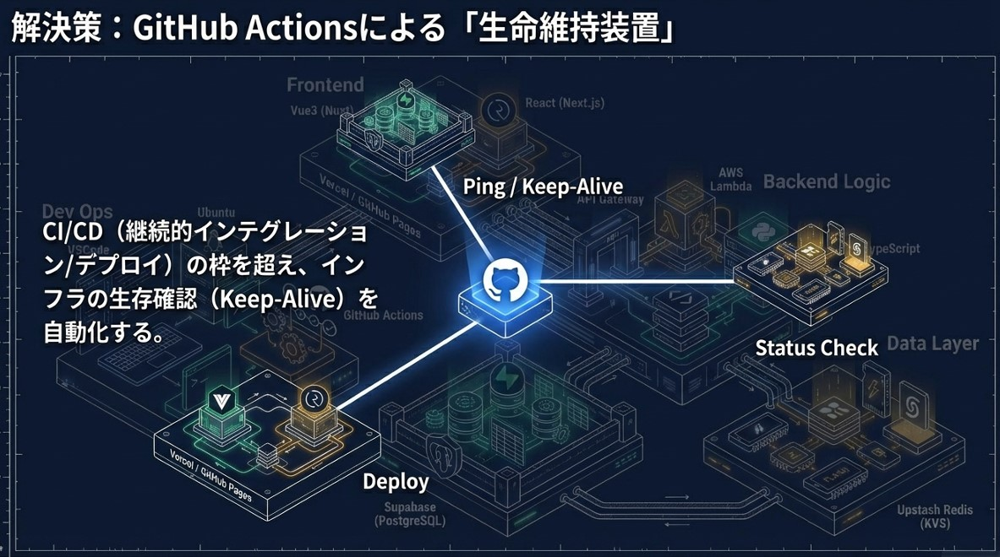
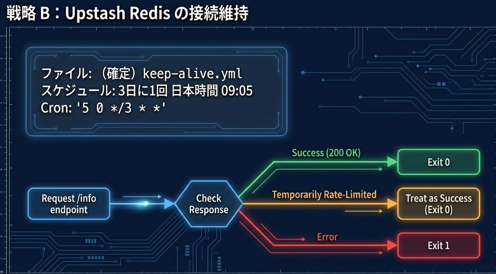
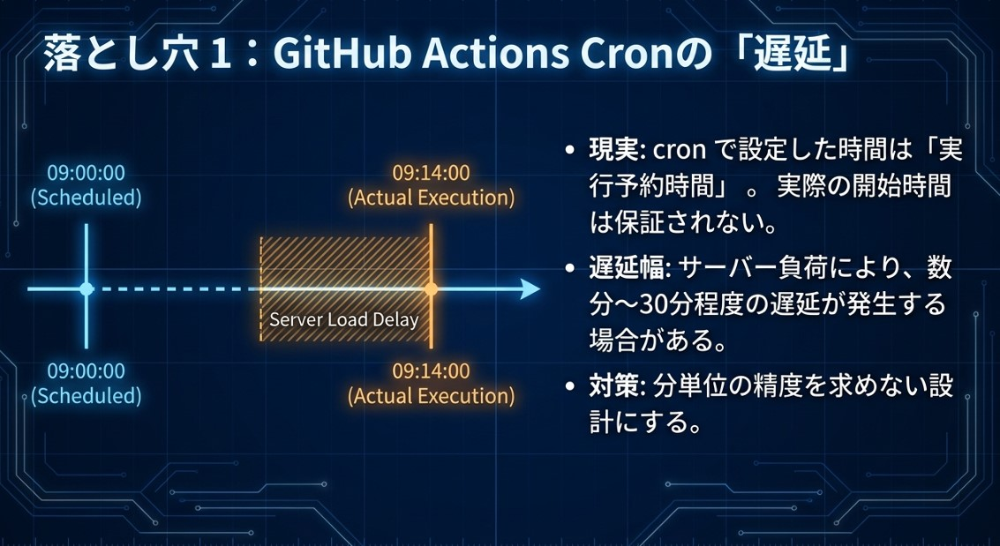

# 完全無料枠で構築する「自律型エコシステム：Game Hub」

---

## 第1章（スライド1）タイトル：完全無料枠で構築する 自律型エコシステム：Game Hub

### ねらい（このスライドで伝えること）

* 「完全無料枠」で、サービスを“止めずに”運用するための設計思想を提示する。
* 対象は **Game Hub** を例にした、サーバレス＋自動化による運用最小化。

### ポイント

* 無料枠で作ると「動かす」までは簡単だが、「継続稼働」が課題になる。
* 本資料は、**自動化（Keep-Alive/監視/デプロイ）で“自律稼働”を実現する設計**を紹介する。

---

## 第2章（スライド2）技術スタック：分散型モダンアーキテクチャ

### ねらい

* “どの部品を、どの無料枠に載せるか”の全体像を示す。

### 構成要素（要約）

* **Frontend**：Vue/Nuxt または React/Next.js
* **Backend**：API Gateway + AWS Lambda（Python/TypeScript想定）
* **Data Layer**：Supabase（PostgreSQL）、Upstash Redis（KVS）
* **DevOps**：Ubuntu/VSCode + GitHub Actions（自動化の中核）

### ポイント

* 重要なのは個別技術というより、**無料枠の特性を理解して部品配置する設計**である。
* 運用の“手作業”を発生させないために、GitHub Actions をシステムの一部として組み込む。

---

## 第3章（スライド3）無料枠の制約：7日間の静寂＝サービス停止

### ねらい

* 無料枠が止まる理由を、仕様として明確化する。

### 記載内容の要点

* Supabase：<strong>一定期間（例：7日）APIアクセスがないと一時停止（Pause）</strong>になり得る。
* 再開に手動操作が必要な場合があり、**コールドスタート遅延**も起こり得る。
* Upstash：一定期間の非アクティブで接続が切れる可能性。

### 結論（この章のキーメッセージ）

* 無料枠を維持するには、**常時稼働の“Heartbeat（定期アクセス）”が必要**。

---

## 第4章（スライド4）解決策：GitHub Actions による「生命維持装置」

### ねらい

* CI/CD を「デプロイ」だけでなく「稼働維持」に拡張する。

### 何を自動化するか

* **Keep-Alive（定期Ping）**：止まる前に軽量アクセスを打つ
* **Status Check（疎通確認）**：死活・異常の早期検知
* （必要なら）通知・復旧導線も組み込める

### ポイント

* GitHub Actions を“運用担当”にすることで、**人の介入をゼロに近づける**。

---

## 第5章（スライド5）戦略A：Supabase Keep-Alive Workflow（設計）

### ねらい

* Supabase の「停止条件」に対し、最小コストで“動いている実績”を作る。

### 設計の骨子

* 対象：`.github/workflows/keep-alive.yml`
* スケジュール：**毎日 JST 09:00**（cron）
* アクション：REST 経由で **軽量テーブル（例：tags）に最小参照**
* 認証：`SUPABASE_ANON_KEY` を用い、正当なアクセスとして実行

### ポイント

* “重い処理”を回すのではなく、**1レコードだけ取る**など最小負荷に徹する。

---

## 第6章（スライド6）Code Spotlight：Supabase Workflow（実装の意図）

### ねらい

* `curl` 1本の意味（なぜそれで十分か）を説明する。

### 実装意図（要点）

* `select=id&limit=1` のように **最小取得**にして、リソース消費を抑える。
* APIアクセスの事実を作り、プロジェクトが「非アクティブ」と判定されないようにする。
* ヘッダ（apikey/Authorization）で **Secrets を参照**し、リポジトリに鍵を残さない。

### 注意点（運用）

* 参照するテーブルは、**必ず存在するもの**（後述の落とし穴参照）。

---

## 第7章（スライド7）戦略B：Upstash Redis の接続維持（設計）

### ねらい

* Redis 側の“非アクティブ切断”に対する、現実的な維持策を示す。

### 設計の骨子

* ファイル：`keep-alive.yml`（または同等）
* スケジュール：**3日に1回 JST 09:05**（cron）
* 動作：`/info` 等の軽量エンドポイントへリクエストし、応答で判定

### 判定ロジック（意図）

* **200 OK**：成功として終了
* **Rate Limited**：無料枠では起こり得るため、**成功扱い**で終了（落とさない）
* **その他エラー**：失敗終了（可観測性を上げる）

---

## 第8章（スライド8）戦略C：VitePress デプロイの完全自動化

### ねらい

* ドキュメント/サイトの公開を “Pushだけ” にする。

### ワークフロー概要

* Trigger：`main` への push
* Build：`npm install` → `npm run docs:build`
* Artifact：生成物をアップロード
* Deploy：GitHub Pages へデプロイ

### キーメッセージ

* **開発者はコードを書く**、**運用作業はゼロ**（自動化に寄せる）。

---

## 第9章（スライド9）落とし穴1：GitHub Actions Cron の「遅延」

### ねらい

* 「毎日9時に必ず実行される」前提が危険である点を伝える。

### 実態

* cron の時刻は“実行予約”であり、**開始時刻は保証されない**。
* 負荷等で **数分〜30分程度の遅延**が起き得る。

### 対策（設計指針）

* 分単位の厳密さを求めない（許容幅を前提に設計する）。
* “止まる前”に余裕のある頻度で打つ（保険をかける）。

---

## 第10章（スライド10）落とし穴2：ブランチ仕様とテーブル参照

### ねらい

* 「設定は正しいのに動かない」典型原因を潰す。

### 典型ポイント

1. **Default Branch のルール**

   * スケジュール実行は、基本的に **デフォルトブランチ上の workflow を参照**する前提になる。
2. **テーブル名の整合性**

   * 存在しないテーブルを参照すると **404** などで失敗する。
   * 修正例：`games` → `page_views` や `tags` など、確実に存在するものへ。
3. **環境変数/Secrets**

   * `SUPABASE_URL` 等が正しく入っているかを確認（キーの取り違い・末尾スラッシュ等も注意）。

---

## 第11章（スライド11）結論：ゼロコストを実現する自動化アーキテクチャ

### ねらい

* これまでの戦略A/B/Cを「一枚絵」に統合して締める。

### 要点（まとめ）

* Frontend：静的ホスティング＋自動デプロイ
* Backend/Data：定期 Keep-Alive ＋状態維持
* Ops：GitHub Actions による完全自律運用

### メッセージ

* 必要なのは「予算」ではなく、**工夫と自動化技術**。

---

## 第12章（スライド12）コードを探索する（QR/リンク案内）

### ねらい

* 実物（Game Hub）とリポジトリへ誘導し、再現可能性を担保する。

### ポイント

* QR でデモへ誘導（閲覧者がすぐ確認できる導線）。
* リポジトリは公開前提（または社内向けにリンク差し替え）。
* 「あなたのプロジェクトでも heartbeat を実装して継続稼働させよう」という行動喚起で締める。