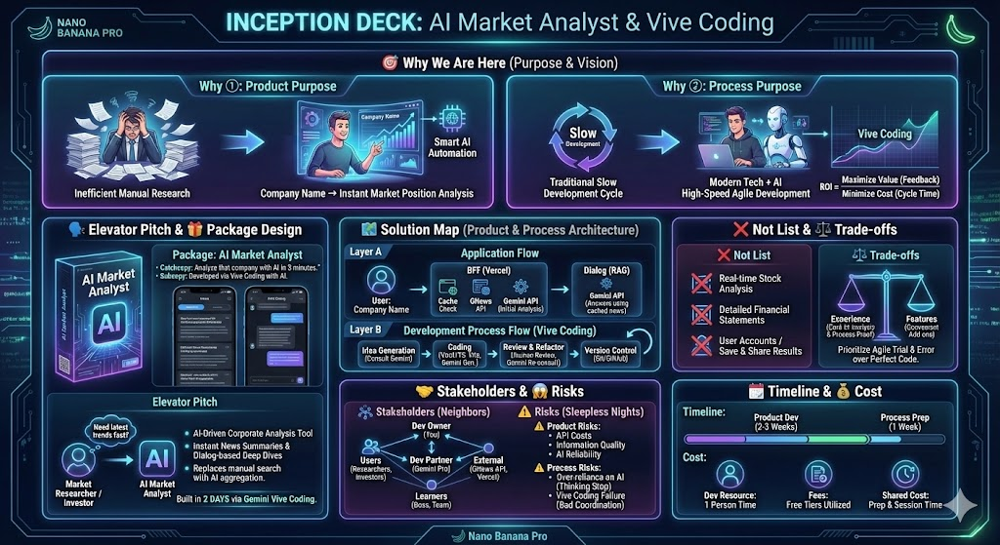

# 私たちの共通認識 (Inception Deck)

このインセプションデッキは、私たち（私とGemini）がプロジェクトの目的とゴールを共有し、共通認識を形成するために作成したものです。

すべての始まりは、以下のような、少し漠然とした、しかし本質的な問いをGeminiに投げかけることからでした。

> **【重要：こんな感じの依頼】**
>
> **私からGeminiへのプロンプト例:**
> 「新しいWebアプリケーションのアイデアがあるんだけど、チームで目的を共有するための『インセプションデッキ』を作りたいんだ。
>
> **テーマ:** 企業名を入れるだけで、AIが市場での立ち位置を分析してくれる『AIマーケットアナリスト』
> **開発手法:** 私と君（Gemini）がペアプロする『ヴィーヴコーディング』で、アジャイルに高速開発することも目的の一つ。
>
> この2つの要素を踏まえて、インセプションデッキの全10項目を埋めるための、たたき台を作ってくれないかな？」

このプロンプトを起点とした対話を通じて、私たちは以下の共通認識を固めていきました。

---

## 1. 我々は何故ここにいるのか？ 🎯

**(Why① - プロダクトの目的)**
市場調査の手作業は非効率だ。これをAIで自動化し、「企業名だけで市場での立ち位置がわかる」体験を届けたい、と私は考えた。

**(Why② - プロセスの目的)**
私が実践する、モダン技術とAIを組み合わせた<strong>「ヴィーヴコーディング」</strong>が、いかに高速でアジャイルな開発を実現できるか。その手法をチームの新たな選択肢として提示したい。 
このプロセスは、私たちのROIの定義（価値÷コスト）における、分子（フィードバック総量）を最大化し、分母（サイクル時間）を最小化するための具体的な答えです。

## 2. エレベーターピッチ 🗣️

**市場調査担当者や投資家**が、**最新動向を素早く把握したい**と考えたとき、**AIマーケットアナリスト**は、**AI駆動型の企業分析ツール**です。このツールは、**最新ニュースの要約と、対話による深掘り分析を瞬時に提供**します。従来の**手作業によるニュース検索**とは違い、**AIによる情報の自動集約と対話形式の深掘りを可能にする**点が特徴であり、このプロダクト自体が<strong>「Geminiとのヴィーヴコーディング」という最先端の開発プロセスによって二日間で構築</strong>されました。

## 3. パッケージデザイン 🎁

**製品名: AI Market Analyst**

**キャッチコピー: その企業、AIが3分で分析します。**
**サブコピー: このアプリは、AIとのヴィーヴコーディングで開発されました。**

- **企業名だけで即時分析**: 複雑な操作は不要。
- **最新ニュースをAIがレポート**: Web上の膨大なニュースから重要事項を抽出。
- **対話形式で気になる点を深掘り**: AIアナリストとの対話で知りたい情報を深掘り。
- **[開発プロセス実証]**: モダン技術スタックとAIの連携によるアジャイル開発のケーススタディ。

## 4. やらないことリスト 🙅

- 株価のリアルタイム分析や投資判断の推奨
- 財務諸表の詳細な分析
- ユーザーアカウント機能や、分析結果の保存・共有機能

## 5. 「ご近所さん」を探せ 🤝

- **ユーザー**: 市場調査担当者、投資家、経営企画・事業開発担当者
- **開発手法の学習者**: 上司、チームメンバー
- **開発オーナー**: プロジェクト推進者 (あなた)
- **開発パートナー**: Gemini Pro
- **外部連携**: GNews API, Vercelプラットフォーム

## 6. 解決案を描く 🗺️

**A) アプリケーションの仕組み**
1. **入力**: ユーザーが企業名を入力。
2. **BFF (Vercel)**: キャッシュを確認後、GNews APIでニュースを取得し、Gemini APIで初期分析。
3. **対話 (RAG)**: ユーザーの追加質問に対し、キャッシュされたニュースを知識源としてGemini APIが回答。

**B) 開発プロセスの仕組み (AIとのヴィーヴコーディング)**
1. **アイデア出し**: Geminiに新機能のアイデアや設計パターンを相談。
2. **コーディング**:
   - **Vue3/TypeScript**で書かれたコードの雛形をGeminiが生成。
   - **Vite**の高速なホットリロード環境で、AIの提案を即座に試す。
3. **レビュー＆リファクタリング**: 生成されたコードを人間がレビュー。改善点を再度Geminiに相談し、品質を向上させる。
4. **バージョン管理**: **Git/GitHub**でコードを管理し、実験的な実装も安全に行う。

## 7. 夜も眠れなくなる問題 😱

- **プロダクトのリスク**: APIコスト、情報の質、AIの信頼性。
- **プロセスのリスク**:
  - **AIへの過度な依存**: AIの提案を鵜呑みにし、開発者自身の思考が停止してしまうリスク。
  - **ヴィーヴコーディングセッションの失敗**: セッション中に、Geminiが期待通りの回答をせず、うまく連携できない可能性。

## 8. 期間を見極める 🗓️

- **プロダクト開発 (2-3週間)**: コア機能の実装とデプロイ。
- **プロセス共有の準備 (1週間)**: ヴィーヴコーディングセッションのアジェンダ作成、資料準備。

## 9. 何を諦めるのか ⚖️

- **機能より体験**: 便利な追加機能よりも、コアとなるAI分析体験と、それを生み出す開発プロセスの実証に集中する。
- **完璧なコードよりアジャイルな試行錯誤**: 最初から100点のコードを目指すのではなく、AIとの対話を通じて素早くプロトタイプを作り、改善していくプロセスを重視する。

## 10. どれだけかかるのか 💰

- **開発リソース**: 開発者1名の時間。
- **費用**: 各種サービスの無料枠を活用。
- **共有コスト**: チームへ開発プロセスを共有するための準備とセッション実施にかかる時間。

